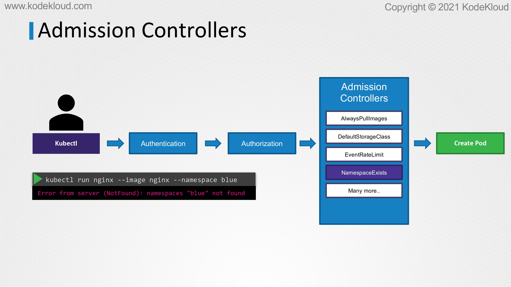
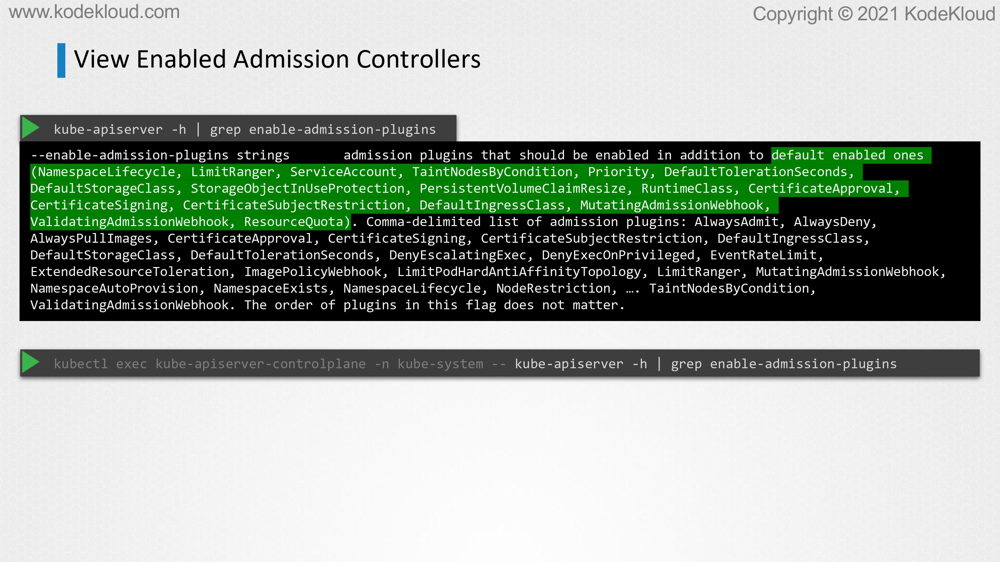
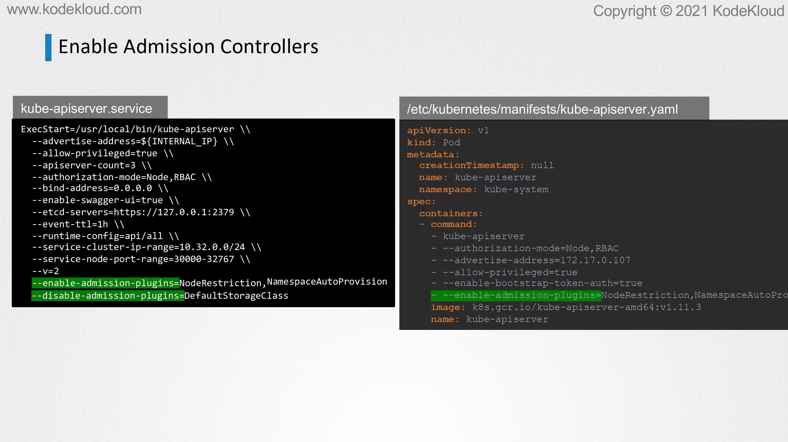
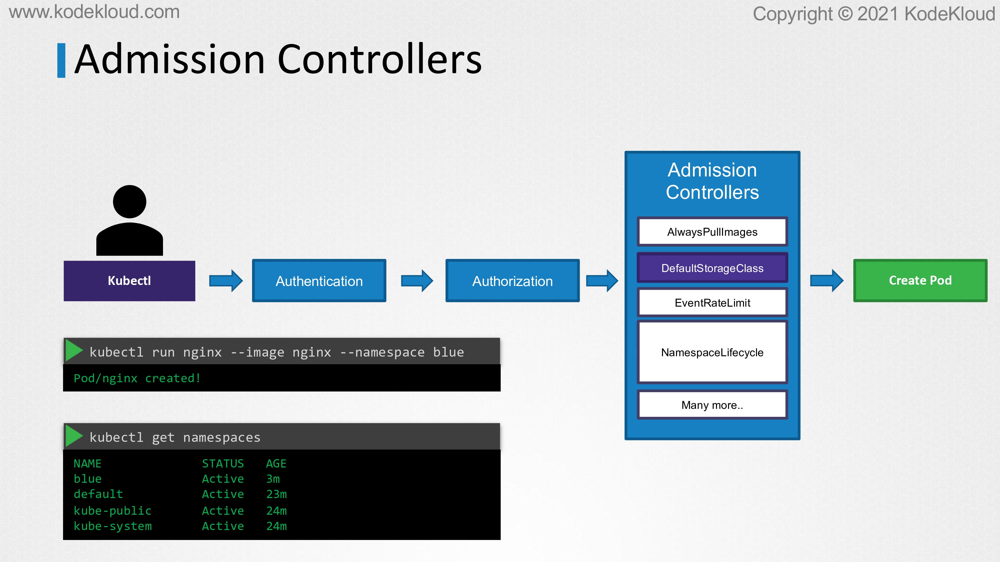

# Admission Controllers

<figure><figcaption></figcaption></figure>

* In this lecture, we will learn about admission controllers. We've been running commands from our command line using the kubectl utility to perform various operations on our Kubernetes cluster. We know every time we send a request say to create a pod, the request goes to the API server, and then the pod is created and the information is finally persisted in the etcd database. When the request hits the API server, we've learned that it goes through an authentication process and this is usually done through certificates.

<figure><figcaption></figcaption></figure>

* If the request was sent through to kubectl, we know the kubeconfig file has the certificates configured. The authentication process is responsible for identifying the user who sent the request and making sure the user is valid.

<figure><figcaption></figcaption></figure>

* Then the request goes through an authorization process, and this is when we check if the user has permission to perform that operation. We have learned that this is achieved through role-based access controls.
* In this case, if the user was assigned this particular role of a developer, the user is allowed to list, get, create, update, or delete parts. If the request that came in matched any of these conditions, in this case, it does as a request is to create a pod, it is allowed to go through, otherwise, it's rejected. That's authorization with role-based access control.

<figure><figcaption></figcaption></figure>

* Now, with role-based access control, you could place in different kinds of restrictions such as to allow or deny those with a particular role to say, create, list, or delete different kinds of objects like pods, deployments, or services, we could even restrict access to specific resource names such as the developer can only work on pods named blue or orange, or restrict access within a namespace alone.
* Now, as you can see, most of these rules that you can create with role-based access control is at the Kubernetes API level, what user is allowed access to what kind of API operations.
* It does not go beyond that. What if you want to do more than just define what kind of access a user has to an object?
*

<figure><figcaption></figcaption></figure>

* For example, when a pod creation request comes in, you'd like to review the configuration file and look at the image name and say that you do not want to allow images from a public Docker hub registry, only allow images from a specific internal registry.
* Or to enforce that we must never use the latest tag for any images or say, for example, you'd like to say if the container is running as the root user, then you do not want to allow that request, or allow certain capabilities only, or to enforce that the metadata always contains labels.

<figure><figcaption></figcaption></figure>

* These are some of the things that you can't achieve with the existing role-based access controls. That is where admission controllers comes in.
* Admission controllers help us implement better security measures to enforce how a cluster is used.
* Apart from simply validating configuration, admission controllers can do a lot more such as change the request itself or perform additional operations before the pod gets created.
* We will go over some examples in the upcoming slides.

<figure><figcaption></figcaption></figure>

* There are a number of admission controllers that come prebuilt with Kubernetes such as AlwaysPullImages that ensures that every time a pod is created, the images are always pulled. The DefaultStorageClass admission controller that observes the creation of PVCs and automatically adds a default storage class to them if one is not specified. The EventRateLimit admission controller can help set a limit on the request where the API server can handle at a time to prevent the API server from flooding with requests.
* The NamespaceExists admission controller rejects requests to namespaces that do not exist.
* There are many more admission controllers available. Let's take that as an example and look at it in a bit more detail, the NamespaceExists admission controller.
*

<figure><figcaption></figcaption></figure>

* Say we want to create a pod in a namespace called blue that doesn't exist. If I run this command, it will throw an error that says the namespace blue is not found. What's happening here is that my request gets authenticated and then authorized and it then goes through the admission controllers.
* The NamespaceExists admission controller handles the request and checks if the blue namespace is available. If it is not, the request is rejected.
* The NamespaceExists is a built-in admission controller that is enabled by default.

<figure><figcaption></figcaption></figure>

* There's another admission controller that is not enabled by default, and that is called as the NamespaceAutoProvision admission controller. This will automatically create the namespace if it does not exist.

<figure><figcaption></figcaption></figure>

* We will see how it can be enabled in a minute. First, to see a list of admission controllers enabled by default, run the kube-apiserver -h command and grep for enable-admission-plugins. Now here, you'll see a list of admission controllers that are enabled by default, the ones that are highlighted in green.
* Note that if you're running this in a kubeadm based setup, then you must run this command within the kube-apiserver-controlplane pod using the kubectl exec command first like this.

<figure><figcaption></figcaption></figure>

* To add an admission controller, update the enable-admission-plugins flag on the Kube-apiserver service to add the new admission controller. If you're in a kubeadm based setup, then update the flag within the Kube-apiserver manifest file as shown here on the right. The one on the left is if you're updating the Kube-apiserver service, and the one on the right is if the API server is running as a pod in a kubeadm based setup. Similarly, to disable admission controller plugins, you could use the disable-admission-plugins flag.

<figure><figcaption></figcaption></figure>

* Once updated, the next time we run the command to provision a pod in a namespace that does not exist yet, the request goes through authentication, then authorization, and then the NamespaceAutoProvision controller at which point it realizes that the namespace doesn't exist. It creates the namespace automatically and the request goes through successfully to create the pod.
* If you list the namespaces now, you'll see that the blue namespace is automatically created.
* That's one example of how an admission controller works. It can not only validate and reject requests from users, it can also perform operations in the backend or change the request itself.
* Note that the NamespaceAutoProvision and the NamespaceExists admission controllers are deprecated and is now replaced by the NamespaceLifecycle admission controller.
* The NamespaceLifecycle admission controller will make sure that requests to a non-existent namespace is rejected, and that the default namespaces such as default kube-system and kube-public cannot be deleted.
