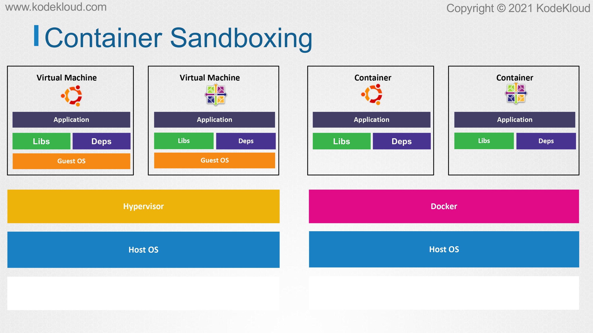
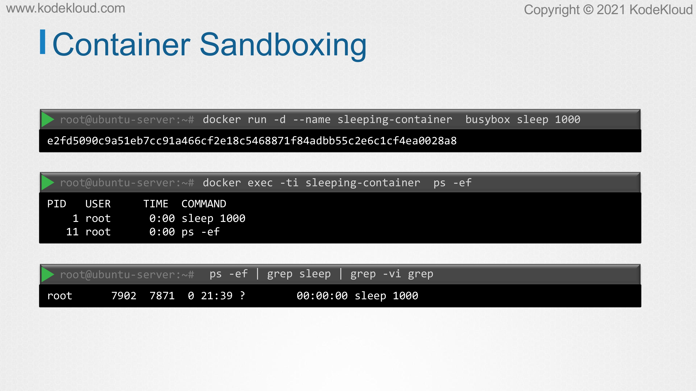
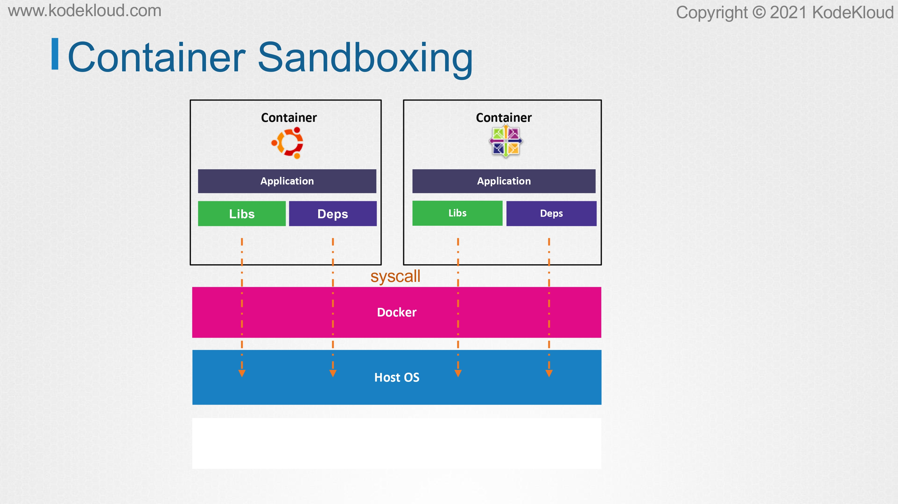
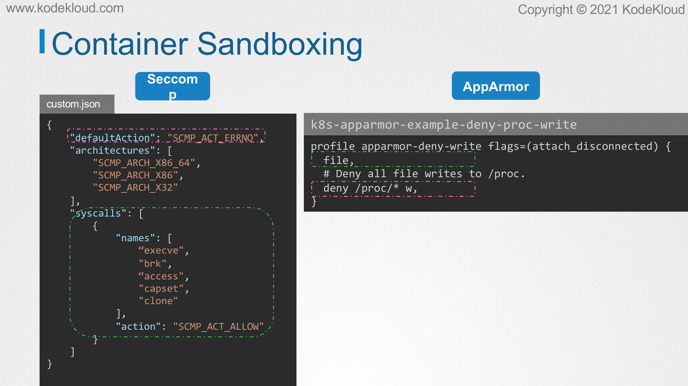

# Container Sandboxing

<figure><figcaption></figcaption></figure>

* WEBVTT -In this lecture, let’s take a look at how to improve isolation in containers using sandboxing techniques.&#x20;
* Before we understand what sandboxing means in relation to containers, let’s have a quick look at how virtual machines work.&#x20;
* Every virtual machine is deployed on top of a physical infrastructure. A physical server with sufficient RAM storage, and several CPU cores available at its disposal. We then have an operating system installed on top of this hardware.&#x20;
* Next, we have the hypervisor, for example, a type 2 such as an Oracle VirtualBox or some of the virtualization software installed on the operating system.&#x20;
* Finally, we can carve out several virtual machines on top, allocating the RAM and CPU cores to them as needed.&#x20;
* As you desire, each virtual machine can run different operating systems of their own.&#x20;
* The point to take away here is that every virtual machine has its own operating system, and more importantly, a dedicated kernel of its own.

<figure><figcaption></figcaption></figure>

* The same is applicable for virtual machines on the cloud. Every VM that we create on the cloud, whether it’s AWS, Azure, GCP, or any other cloud provider, make use of dedicated kernel of its own. This allows for a strong isolation between virtual machines that run on the same physical infrastructure.&#x20;
* Because of the strong isolation that virtual machines offer, it can be used to securely host several different environments belonging to several different customers. Such as set up is often called as multitenant environment.

<figure><figcaption></figcaption></figure>

* Comparing a virtual machine to a container, one of the key differences is that all containers on a server, whether it’s running on a virtual machine, or a physical server share the same underlying kernel. From the perspective of a host, it’s just another process which is isolated from the host and other containers running on it.

<figure><figcaption></figcaption></figure>

* How good is this isolation? For example, let us run a BusyBox container that sleeps for 1,000 seconds. Of course, this container will run the sleep command as a root user within the container that has the PID of one.&#x20;
* Now, if you’re on a PS command on the host, where we ran the container, we can see the same process running on the host, but with a different PID. The process has one PID inside the container and another one outside on the host.&#x20;
* This is called Process ID namespace, and that’s how containers isolate process from each other. Like this from the host, you’ll be able to see our processes running on all containers. If he kill this process on the host, it will also wipe out the container.

<figure><figcaption></figcaption></figure>

* We saw earlier that applications, whether deploy directly on the OS or as a container, run in the user space.&#x20;
* To make use of the server’s hardware resources, we have to make system calls. Here lies the problem when it comes to containers and isolation.
* &#x20;Unlike virtual machines on a physical server which have a dedicated kernel, containers on a host share the same kernel. Every container in the host makes syscalls to the same kernel to work properly.&#x20;
* We also demonstrated how an exploit such as the Dirty COW, can be used to break out of the container and into the host which is running a vulnerable kernel.&#x20;
* That’s such an exploit, a compromised container can create a backdoor entry onto the host, and therefore, compromise all the other containers running on it. This is undoubtedly a huge security breach as private information stored on the host can now be leaked by the attacker.
* &#x20;It is a concrete example of how simple containers can feel at keeping tenants inside their own box. How can we get additional prediction measures?&#x20;
* Well, this is where sandboxing comes into the picture. Sandbox can have several different meanings in the computing world, but in the context of security, sandboxing refers to as any technique that isolates something from the rest of the system.

<figure><figcaption></figcaption></figure>

* We have already seen some of these techniques in action. Earlier, we learned how Docker uses a default Seccomp profile to make sure that containers cannot make potentially dangerous system calls.
* &#x20;We also saw how Seccomp can be used in Kubernetes and restrict containers to the bare minimum privileges needed for the application to run. We also saw how to make use of AppArmor profiles to achieve fine-grain control over which resources a container can access. Both of these techniques more or less work on the same principle.&#x20;
* Whitelist the things a container is allowed to do and blacklist those that it should not be able to do. A whitelist blocks everything by default.&#x20;
* As in the case of this Seccomp profile that blocks every syscall as its default action. We then add the syscalls we know the application needs.&#x20;
* Now, the application which uses this profile can only make use of these file syscalls. Whitelists are good when we know what exactly our application needs to do its job.&#x20;
* From a security standpoint, they are better since they are the most restrictive. On the other hand, a blacklist allows everything, as in the case of this AppArmor profile. The first line here allows all access on the file system.
* &#x20;We then define what we want to disallow such as denying right access to all files under the /proc file system. Blacklists are good when we want to make sure that our rules are not so restrictive that it makes the app to stop working.&#x20;
* Or when we want to apply this rule set to many apps that behave in different ways.

<figure><figcaption></figcaption></figure>

* It makes sense to use tools such as AppArmor, Seccomp, or any other tools when we don’t run a lot of different apps in our containers.&#x20;
* For example, even though we may have thousand containers, if they all run in GenX or MySQL, we only have to define two rule sets, which does not require that much work.&#x20;
* What if you run 500 different applications? It would then be very tedious to write profiles for all of them and then to test out the rules enforced in hundreds of different scenarios and to make sure everything still works correctly.&#x20;
* Even with the help of third-party tools, writing efficient profiles is not an easy task. We have to keep one thing in mind, though, nothing is perfect.&#x20;
* Every security measure has advantages and disadvantages. A price to pay, so to speak. There is no one best way that is good at everything.&#x20;
* We have to pick and choose which works best for us and for our specific scenario. In the upcoming lecture, let’s take a look at a different approach to container sandboxing.
