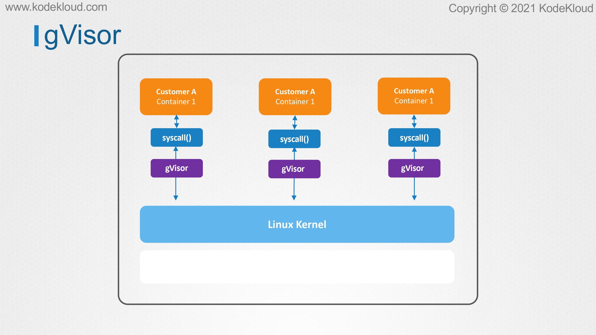
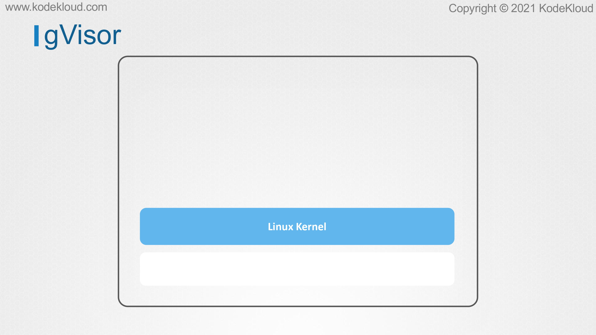
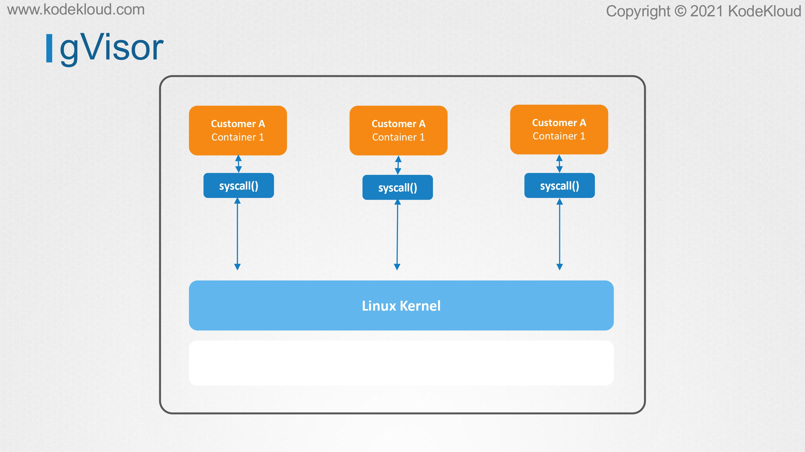
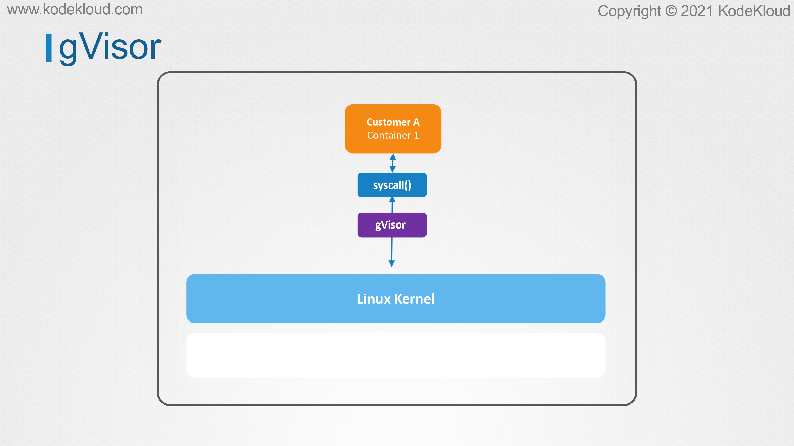
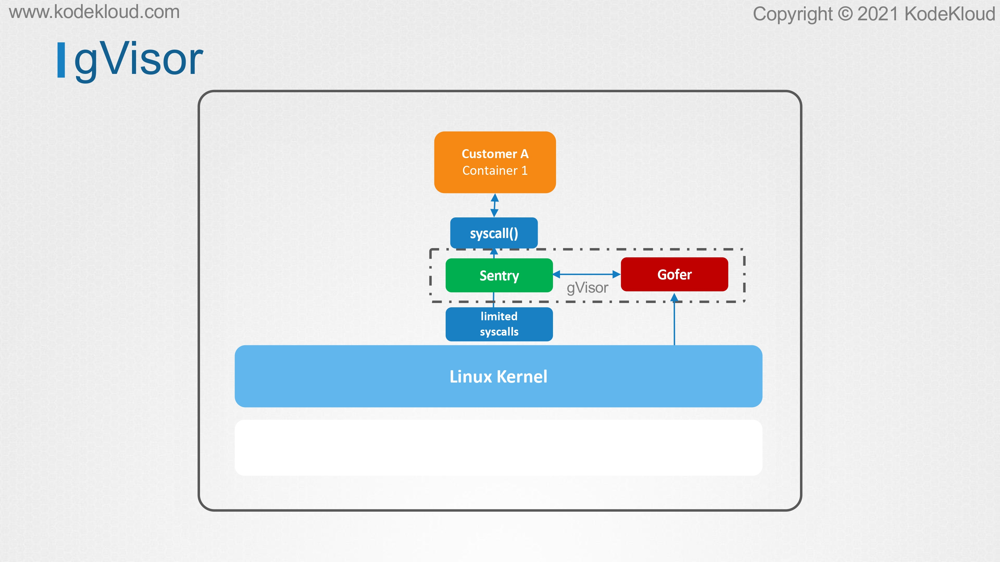

# gVisor

<figure><figcaption></figcaption></figure>

* In this lecture, we'll take a look at some alternative techniques to achieve container sandboxing and get introduced to gVisor.&#x20;
* The Linux kernel is very complex and it is designed in such a way that it can serve almost any application that we can think of.&#x20;
* It can power a computer that is streaming a Netflix video, but it can also power a rocket to the moon.&#x20;
* It allows applications to do thousands of different things via syscalls, and also providing additional privileges and capabilities as needed.&#x20;
* While this is great as far as functionality goes, it is not as good keeping security in mind. Being able to interact directly with the kernel, increases the attack surface, and makes it possible to exploit any existing security issues or discovering new vulnerabilities.&#x20;
* Using exploits such as the Dirty COW that we saw earlier, an attacker can easily break into the host and cause some serious damage. In the previous lecture, we talked about how we can make use of blacklists and whitelists rules with tools such as seccomp and AppArmor to allow and deny certain actions that can be done by containers.&#x20;
* We have to remember that our core problem here in multi-tenant environments is not actually what an app can or cannot do.
* &#x20;The core problem is that they all interact pretty much directly with the same operating system and especially the same kernel.&#x20;
* What we actually want is a way to improve the level of isolation between container and container and between container and the operating system or the kernel.&#x20;
* What if we could isolate a container further and restrict it from making direct system calls to the Linux kernel.&#x20;
* Instead, what if we had an additional layer of protection between the container and the operating system's kernel?&#x20;
* Well, that's exactly what gVisor aims to achieve. gVisor is a tool from Google that allows an additional layer of isolation between the container and the kernel.
* &#x20;We will learn how to implement it in the upcoming lectures, but for now, let's focus on how it works.

<figure><figcaption></figcaption></figure>

<figure><figcaption></figcaption></figure>

<figure><figcaption></figcaption></figure>

* When a program in a container wants to make a system call to the Linux kernel, it's actually making a call to the gVisor now. How does this additional layer help improve the container isolation?

<figure><figcaption></figcaption></figure>

* gVisor sandbox consists of two major components that work together to achieve stronger isolation when compared to traditional containers.&#x20;
* The first component is called Sentry and it can be described as an independent application-level kernel which is dedicated for containers.&#x20;
* The main purpose of Sentry is to intercept and respond to system calls which are made by containerized application.&#x20;
* Sentry is designed with containers in mind, so it supports far fewer functionality than the actual Linux kernel. This reduces the possibilities of flaws that can be exploited by attackers. For example, if the application needs access to a file, Sentry cannot make the access system call directly to the Linux kernel. Instead, Sentry talks to a dedicated process called Gofer.&#x20;
* Gofer is a file proxy that implements the logic that is needed for containerized apps to access the system files. Again, this is like a middleman which is sitting in between the container and the operating system and guarding against any potential abuse.

<figure><figcaption></figcaption></figure>

* Similarly, for network operations, gVisor again makes use of its own network stack. Just like the previous measures, this makes sure that the network operations can be done without containers directly interacting with the operating system's network code, and hence improving the isolation. The most important takeaway here is that it's not just one single gVisor kernel that serves all the containers.&#x20;
* Each containerized environment has its own dedicated gVisor kernel acting as a middleman between the application and the Linux kernel.
* &#x20;This means that each container would now be isolated in its own virtualized sandbox, which drastically reduces the attack surface.&#x20;
* Even if this middleman fails in some way, if it should happen that a gVisor incident breaks in one container, all the other ones will continue to run without any issues. As mentioned earlier, every security measure has its price to pay.
* In this case, the price of a gVisor is that not all apps will work with it. You will just have to test each one of your application and see for yourself. Another disadvantage is that since the system calls are received and processed via a middleman, this means that there are more instructions that CPU has to go through. This can make the application slightly slower as compared to traditional containers. Well, that's it for this lecture. In the next lecture, we'll take a look at Kata Containers, which is another tool used for container sandboxing.
