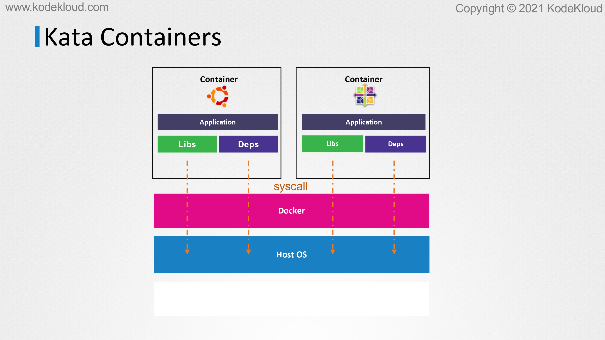
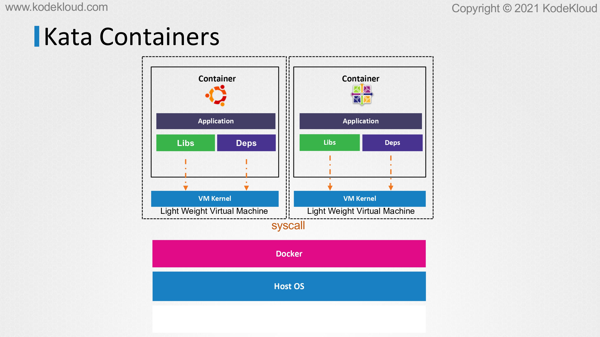
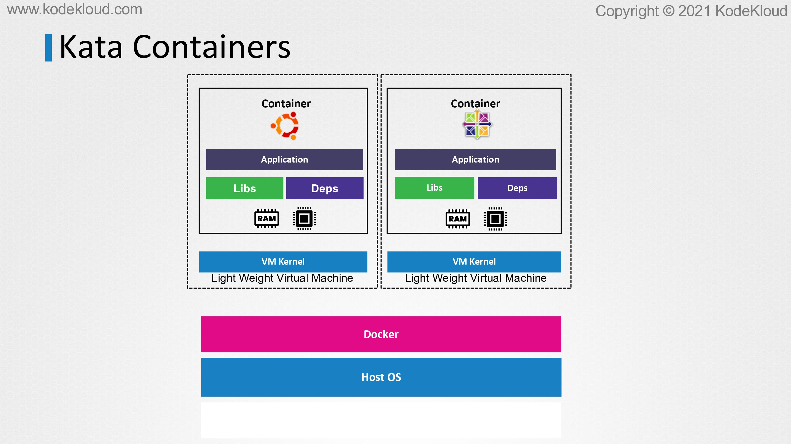

# kata Containers

<figure><figcaption></figcaption></figure>

* Now let’s get introduced to Kata Containers and see how it achieves container sandboxing. Kata takes a different approach to sandbox containers as compared to gVisor.&#x20;
* We already saw that virtual machines are excellent at isolating resources. Why don’t we use VMs to isolate containers?&#x20;

<figure><figcaption></figcaption></figure>

* Kata installs each container into its own separate virtual machine. Each container will have its own dedicated kernel running inside.&#x20;
* Just like gVisor, this gets rid of problems caused when all container apps communicate directly to the same operating systems kernel.
* &#x20;Now, each container has its own little container to bother. If they crash it or abuse it in any way, it doesn’t bring the whole system down. Only that specific container will experience problems instead off all the containers running on the system.

<figure><figcaption></figcaption></figure>

* Here’s the obvious question. Wouldn’t it take a significant amount of time to first create a virtual machine for every single container to be deployed? More importantly, wouldn’t there be concerns around performance?&#x20;
* The virtual machines that are created by Kata are lightweight and are more focused on performance.
* &#x20;However, although the performance is optimized, with the added isolation of a virtual machine, there will be a small performance penalty as compared to traditional containers as each one will now need slightly more memory and compute resources.

<figure><figcaption></figcaption></figure>

* Probably the bigger issue here is that since Kata containers need hardware virtualization support, this means that you might not be able to run it on your typical cloud service provider. A cloud compute instance is already a virtual machine.
* &#x20;If you intend to use Kata, you’re basically trying to run a virtual machine inside another virtual machine. This is called as nested virtualization, which is not supported by many cloud providers. There are a few exceptions though.&#x20;
* For example, Google Cloud does support nested virtualization, but it has to be enabled manually. Also, even if there is support, nested virtualization performance is usually very poor. Of course, if you can make use of dedicated physical servers or bare metal servers on the cloud, you can then run Kata Containers without these performance issues.
