# Manage Kubernetes secrets

<figure>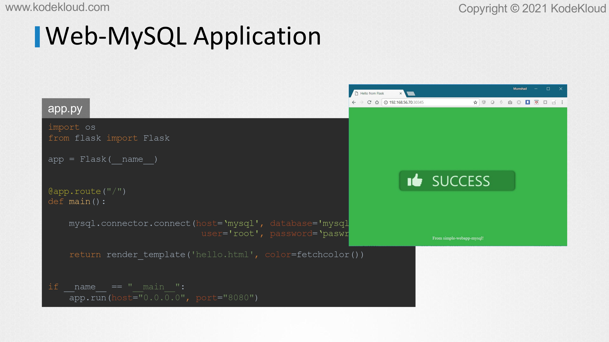<figcaption></figcaption></figure>

* Hello and welcome to this lecture on secrets in kubernetes Here we have a simple python web application that connects to MySQL database on success. The application displays a successful message.

<figure>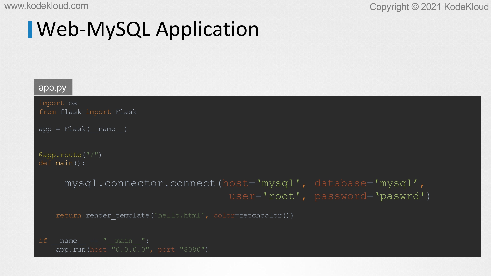<figcaption></figcaption></figure>

* If you look closely into the code you will see the hostname username and password hardcoded. This is of course not a good idea.

<figure>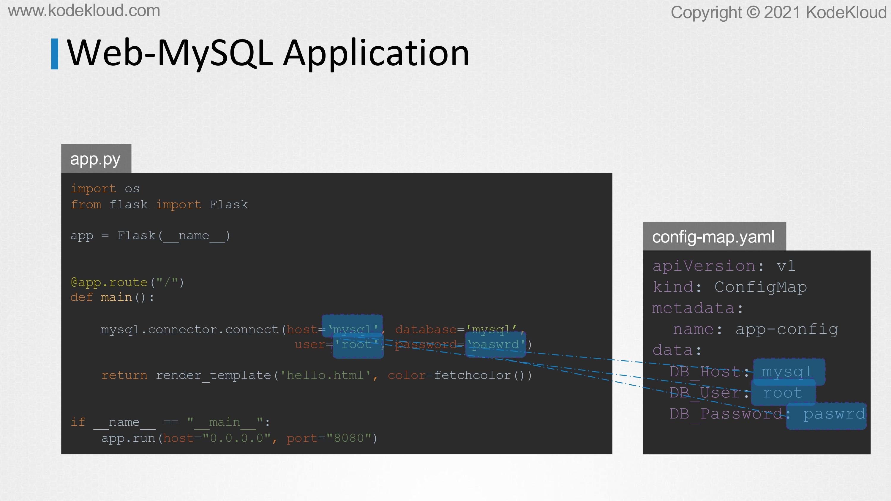<figcaption></figcaption></figure>

* As we learned in the previous lecture one option would be to move these values into a conflict map the conflict map stores configuration data in plain text format. So while it would be okay to move the hostname and username into a conflict map it is definitely not the right place to store a password.

<figure>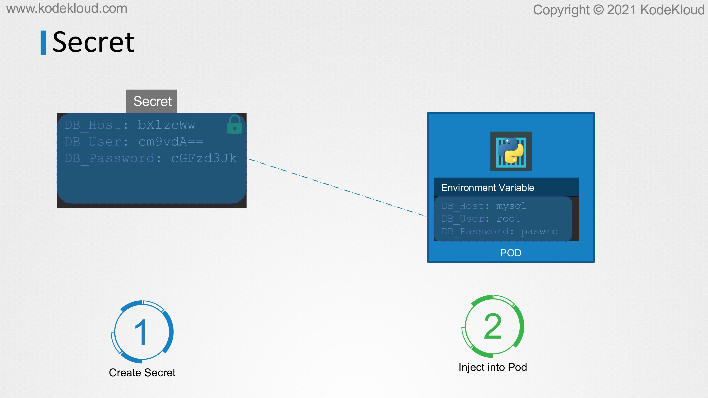<figcaption></figcaption></figure>

* This is where secrets coming secrets are used to store sensitive information like passwords or keys. They're similar to conflict maps except that they're stored in an encoded or hashed format as with conflict maps. There are two steps involved in working with secrets. First create the secret and second injected into pod.

<figure>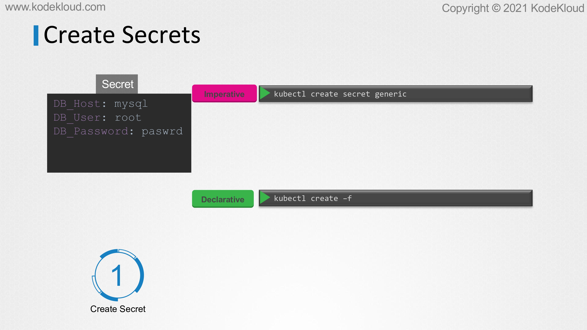<figcaption></figcaption></figure>

* There are two ways of creating a secret. The imperative way without using a secret definition file and the declarative way by using a secret definition file with the imperative method.

<figure>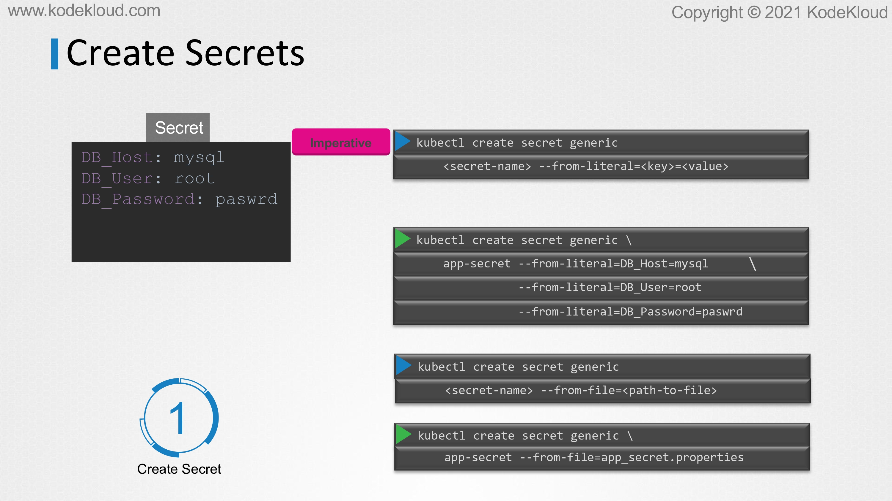<figcaption></figcaption></figure>

* You can directly specify the key value pairs in the command line itself to create a secret of the given values run the kube control create secret generic command.&#x20;
* The command is followed by the secret name and the option from literal, from literal option, is used to specify the key value pairs in the command itself.&#x20;
* In this example we are creating a secret by the name app Secret with a key value pair db underscore MySQL Well if you wish to add additional key value pairs simply specify the from literal options multiple times.
* &#x20;However this could get complicated when you have too many secrets to pass in another way to input the secret data is through a file.&#x20;
* Use the from file option to specify a path to the file that contains the required data. The data from this file is read and stored under the name of the file.

<figure>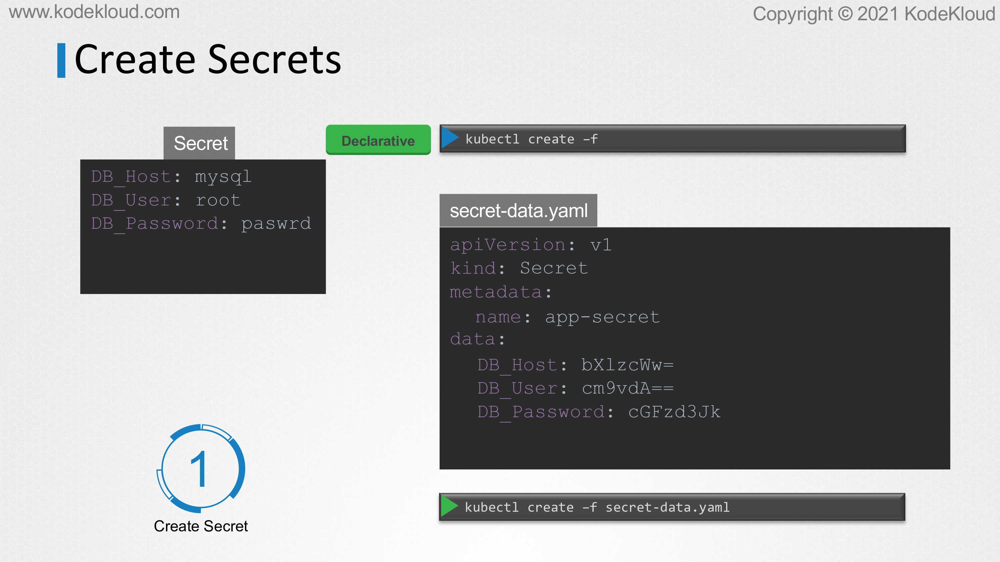<figcaption></figcaption></figure>

* Let us now look at the declarative approach for this. We create a definition file just like how we did for the conflict map.&#x20;
* The file has API version kind metadata and data the API version is V1 kind a secret under metadata specify the name of the secret.
* &#x20;We will call it app Secret under data at the secret data in a key value format. However one thing we discussed about secrets was that they are used to store sensitive data and are stored in an encoded format.&#x20;
* Here we have specified the data in plain text which is not very safe. So while creating a secret with a declarative approach you must specify the secret values in a hashed format.

<figure><figcaption></figcaption></figure>

* So you must specify the data in an encoded form like this. But how do you convert the data from plain text to an encoded format on a linux host run the command echo dash n followed by the text you're trying to convert.&#x20;
* Which is mysql in this case and pipe that to the base64 utility to view secrets run the kube control get secrets command.

<figure>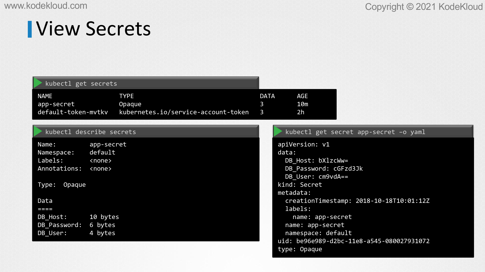<figcaption></figcaption></figure>

* This lets the newly created secret along with another secret previously created by kubernetes for its internal purposes to view more information on the newly created secret. Run the kube control. Describe secret command.&#x20;
* This shows the attributes in the secret but hides the value themselves to view the values as well. Run the kube control get secret command with the output displayed in a Yama format using the dash 0 option.
* You can now see the hash values as well.

<figure>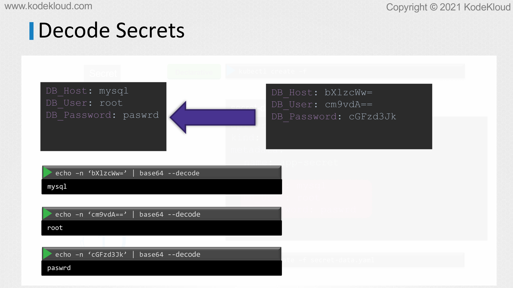<figcaption></figcaption></figure>

* Now how do you decode these hashed values. Use the same base64 Command used earlier to encode it but this time add a decode option to it.

<figure>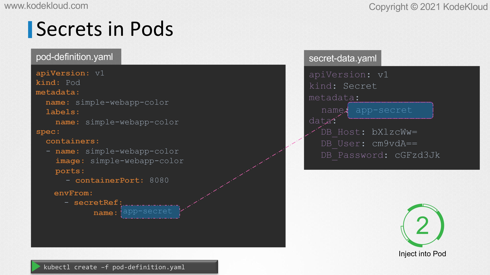<figcaption></figcaption></figure>

* Now that we have secret created let us proceed with step 2 configuring it with a pod.&#x20;
* Here I have a simple part definition file that runs my application to inject an environment variable add a new property to the container called envfrom the envfrom property is a list so we can pass as many environment variables as required each item in the list corresponds to a secret item.&#x20;
* Specify the name of the secret we created earlier creating the pod definition file now makes the data in the secret available as environment variables for the application.

<figure>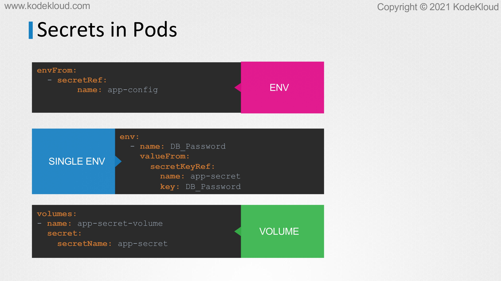<figcaption></figcaption></figure>

* What we just saw was injecting secrets as environment variables into the pods. There are other ways to inject secrets into pods. You can inject a single environment variables or inject the whole secret as files in a volume.

<figure>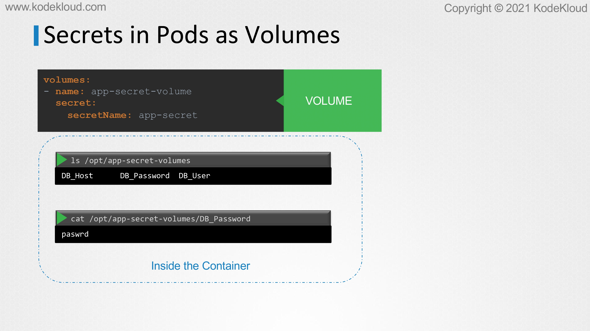<figcaption></figcaption></figure>

* If you were to mount the secret as a volume in the pod each attribute in the secret is created as a file with the value of the secret as its content. In this case since we have three attributes in our secret three files are created and if we look at the contents of the db password file we see the password in it.

<figure><figcaption></figcaption></figure>

<figure>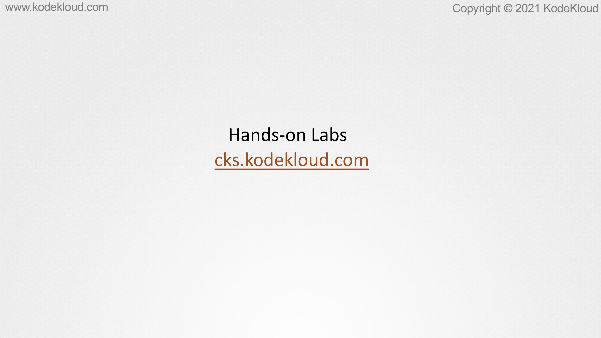<figcaption></figcaption></figure>
