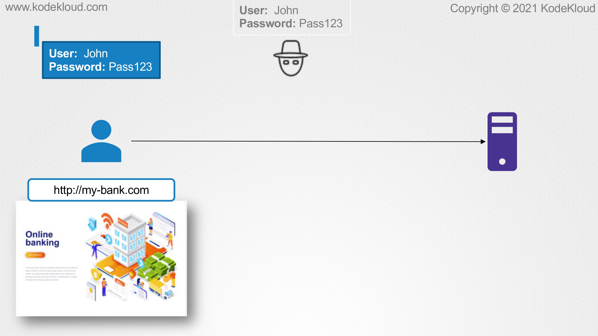
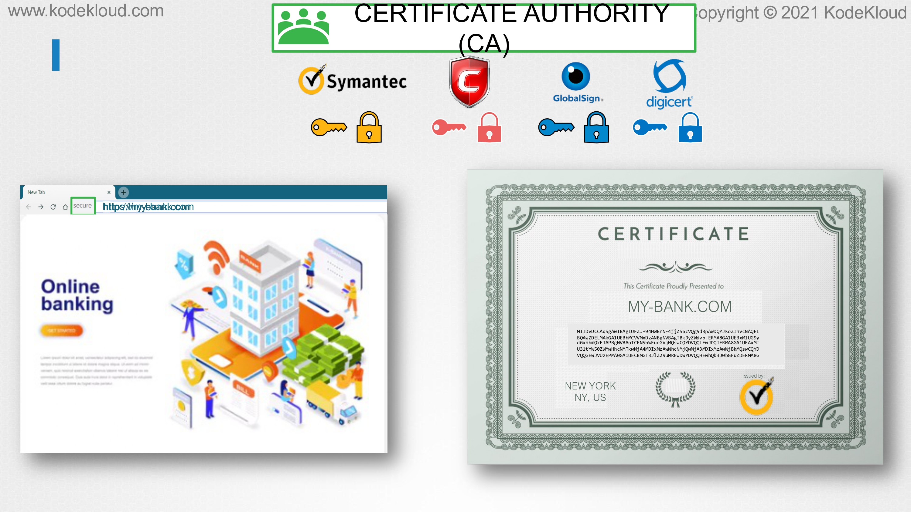
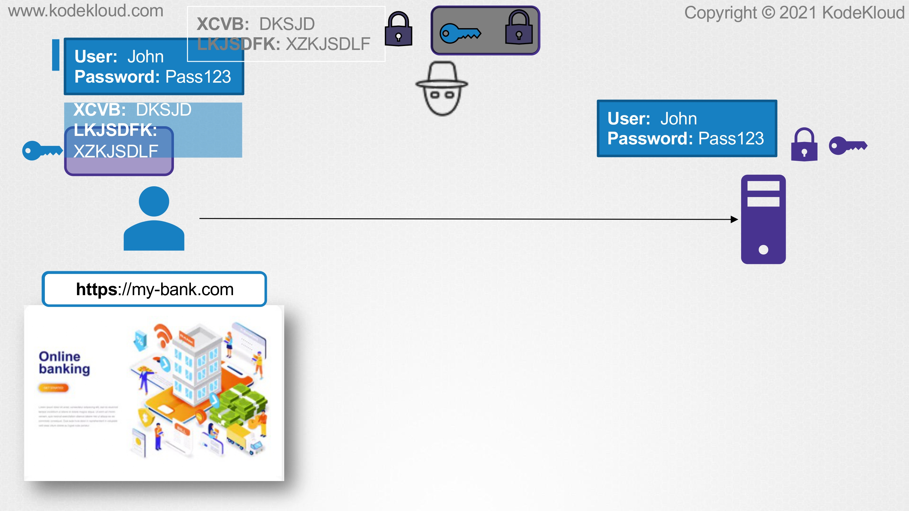
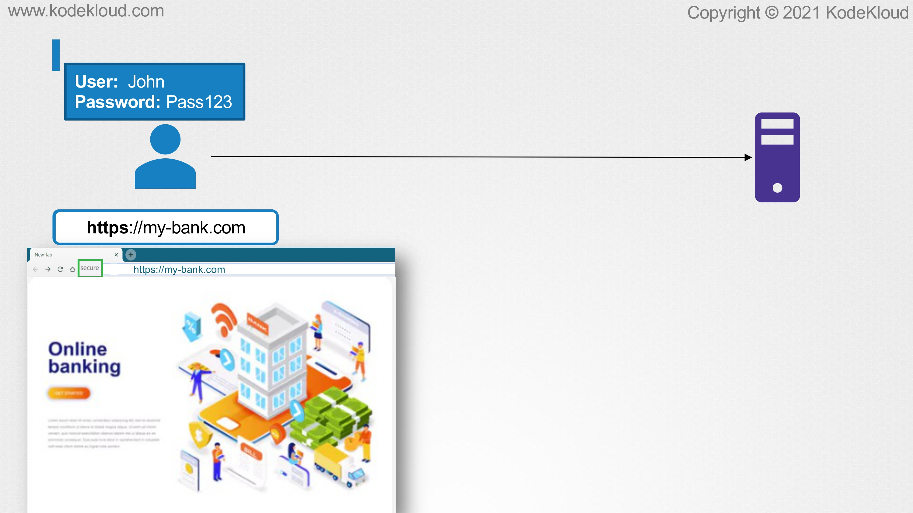
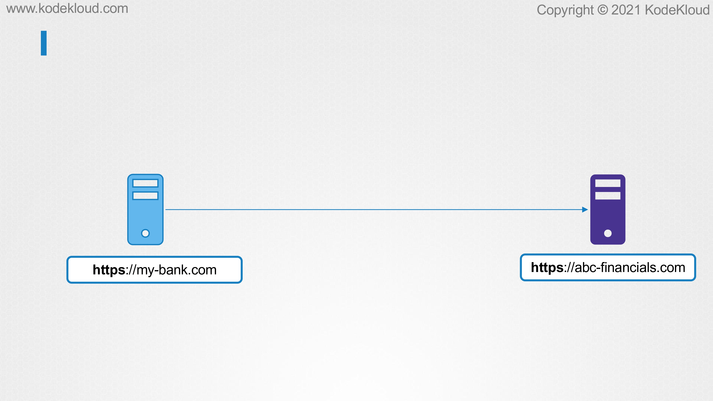
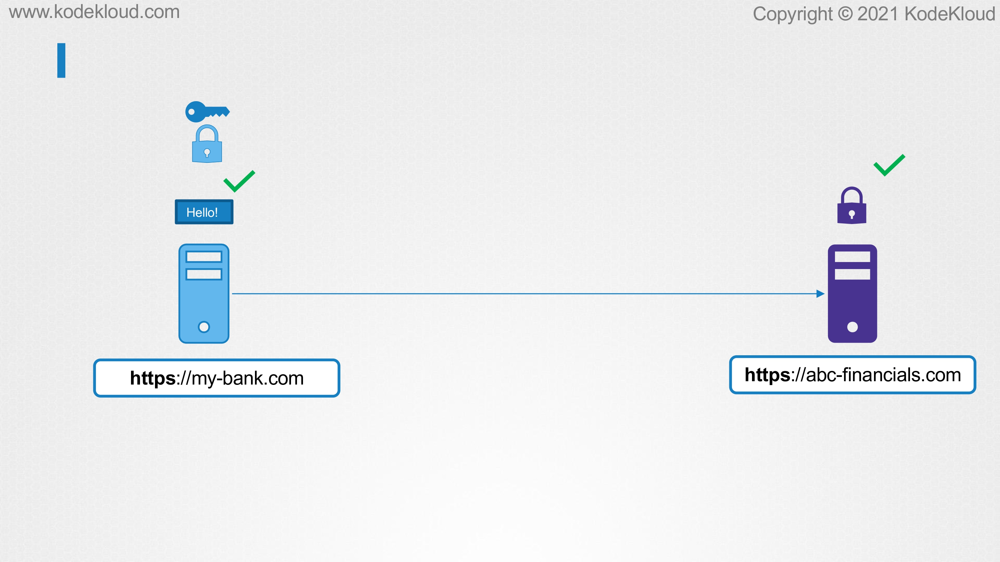

# One way SSL vs Mutual SSL

<figure><figcaption></figcaption></figure>

* In this lecture, we will understand the basics of mTLS or mutual TLS, and see how we can use it to encrypt the traffic between two systems. In one of the earlier lectures, we got an introduction to TLS. We learned how to create SSL certificates and how to use them to secure SSH and web servers. We then used the example of a customer accessing their online banking to demonstrate how, without encryption, an attacker can easily retrieve the user's credentials by sniffing into the network.

<figure><figcaption></figcaption></figure>

* We then learned how to make use of TLS certificates to encrypt the data between the user and the bank enabling a secure connection via HTTPS. When the user first establishes connection with the bank, he receives its public certificate. The web browser on the client will verify if the certificate from the bank is legitimate. To do this, the browser checks if the certificate authority used to sign the certificate is valid. The public keys of all the CA's are built into the browser's trust store. The browser uses the public key of the CA to validate that the certificate was actually signed by the CA themselves.

<figure><figcaption></figcaption></figure>

&#x20;Once it is validated, the client, which is the web browser, uses the public certificate from the bank to encrypt the symmetric key so that it can be sent over to the bank securely. The bank then uses its own private key to decrypt this symmetric key. This is called as asymmetric encryption. Once this is done, the client uses the symmetric key to encrypt all of its data and transfer it to the bank. The bank then uses the same key to decrypt the data. By using asymmetric encryption, we were able to securely transfer asymmetric key from the client machine to the bank, and using symmetric encryption, we were then able to securely exchange information with the bank. A hacker snooping on the network cannot get ahold of the data sent to the bank as he cannot decrypt the symmetric key.

<figure><figcaption></figcaption></figure>

* Here, the client verifies the server certificate, which is the bank certificates on this example. The bank, however, does not verify the client certificate. The only way it knows who you are is based on the actual data that you send to it, that is the user name, password, client number, et cetera.
* This is an example of a one-way SSL and is most commonly used in scenarios where a user wants to connect to a web servers over the internet such as accessing your email account, social media sites, financial institutions, et cetera.
* Just like in this example of my-bank.com, all these web services establish the authenticity of the user based on some form of confidential information such as user name and passwords.

<figure><figcaption></figcaption></figure>

* However, consider another scenario where there is no end user to key in this information. Let us assume that two organizations want to securely exchange confidential information between themselves. Now, let's say my-bank.com is the client who wants to get some data to the sever abc-financials. In this case, how can the server validate that the data is actually being sent by my-bank.com? This is where two-way TLS or mutual TLS is used. With mutual TLS or mTLS, the client and also the server will now verify the authenticity of each other. To make this easier, let us now call my-bank as the client and abc-financials as the server.

<figure><figcaption></figcaption></figure>

* When requesting data from the server, the client first requests the server's public certificate. The server replies back with its public certificate, and then requests the certificate of the client. Meanwhile, the client checks with the CA if this certificate belongs to the server. Once this is verified, the client sends its certificate to the server, and it also shares a symmetric key which is encrypted with the public key of the server. The server now validates with the CA if the public certificate that it received from the client indeed belongs to my-bank.com. Now that both the server and the client have mutually authenticated each other, all further communication from the client to the server can be encrypted using the symmetric key. Well, that's it for this lecture. In the upcoming lecture, we will learn how to make use of mTLS to secure port-to-port communication in a Kubernetes cluster.
