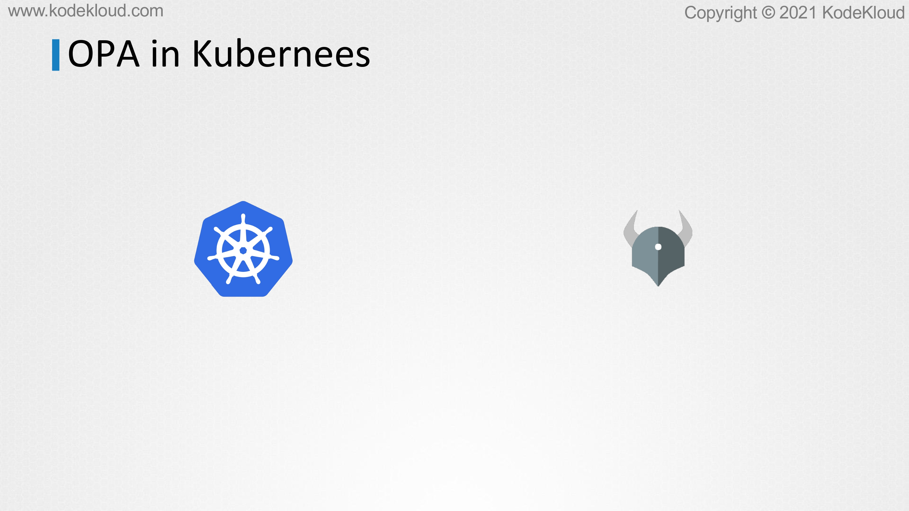

# OPA in Kubernetes

<figure><figcaption></figcaption></figure>

* In this lecture, we'll take a look at the new implementation of OPA and Kubernetes using the Gatekeeper approach. So, the newer, better implementation of OPA in Kubernetes uses what is known as the Gatekeeper approach. With this approach, the admission controller works with the OPA Constraint Framework. It uses CRD-based policies, letting you set policies in a way that's easy to share and trust. So, before we look at what the OPA Constraint Framework is all about, let's see how to deploy OPA Gatekeeper in Kubernetes.

<figure><figcaption></figcaption></figure>

* So, how do we install OPA Gatekeeper and its components? So, this is done by following the instructions available in the OPA Gatekeeper website. Well, as you can imagine, it's as simple as applying the gatekeeper specification files using a kubectl apply command.

<figure><figcaption></figcaption></figure>

* Now, once deployed, make sure that all the gatekeeper services are installed and running as expected. As you can see in this screenshot, there's a number of controller managers, there's the audit service, there's the gatekeeper webhook service, as you can see in this output.

<figure><figcaption></figcaption></figure>

* And, so, let's first understand what the OPA Constraint Framework is, and that's how, and it's when you understand this that you can understand how the whole OPA Gatekeeper concept works. So, now, the OPA Constraint Framework is a framework that helps us implement OPA policies by declaring what is it that we want to do, where do we want to do it, and how are we going to do it? So, meaning, what requirements do I have when it comes to defining restrictions within my environment?
* So, an example of that would be that I want all objects in a specific namespace like example to have a billing label. So, that's a very easy specific example. And next is where do I want to enforce these requirements? So, I want this to be enforced on a Kubernetes admission controller.
* Now, remember that OPA and the whole OPA Constraint Framework are not just specific to Kubernetes. It is meant to support other solutions outside of Kubernetes as well, such as a Git Webhook or admission controller or anything like that.
* But for our requirement, we will just stick to Kubernetes. So, we want the requirement of making sure all objects have the billing label at the Kubernetes admission controller because that's where all the pod creations and any other object that are created within Kubernetes goes through.
* So, it's at that level that we want to apply these restrictions. So, that's kind of the target.So, it's at that level that we want to apply these restrictions. So, that's kind of the target.
* And, lastly, we do, how do I specify what to check and what action to take? So, what I would do is whenever a pod is created or when the pod creation request comes in to the admission controller, I'd get the labels of that object and I make sure that it has the predefined billing label in it. So, that's kind of the check that I would want to do.

<figure><figcaption></figcaption></figure>

* So, let's start with the easy one. Let's start with how we can implement each of these, right? So, let's start with what we already know - the how part.
* Because, now, how do we get the labels of a pod and verify that it has the right label on it? We've already learned this in the previous lectures.
* We used the rego code to define this. In this example, we define the provided label as the labels from the input request object, which is the pod.
* And the required label is defined as billing. Now, if the required labels are missing from the provided label, we return an error message that highlights the missing label.
* So, as you can see here, there are a few variables defined. So, we have the provided variable, which has the label of whatever the object is that we are creating. And then, under required, we have billing, which is statically here.
* And then, missing calculates the required and minus the provided. So, this is basically going to tell you if there are multiple labels listed here or here, then it's going to tell you what are the missing labels, right?
* And then we share an error message to the user saying these particular labels are missing.
* So, that's how the rego code works.

<figure><figcaption></figcaption></figure>

* Next, we're going to look at how to define the Where part. So, this is as easy as specifying the target as admission for Kubernetes. So, in this case, it's always going to be admission.k8s.gatekeeper.sh.

<figure><figcaption></figcaption></figure>

* Now, with the two of these defined, we're able to define how and where. But you see the label that we have set, billing is hard coded here.&#x20;
* So, this code only works for the use case where we check if the label on the pod is set to billing specifically.
* &#x20;And, but we want this to work for any similar use cases. For example, to, say, check if the namespace is payroll, then there must be a label called pay or something. Or if the namespace is engineering, then there must be a label called tech.
* &#x20;So, those are just two other requirements that I have. So, if we want the same kind of code and this whole implementation to work for say, any of these requirements, then what we have to do is we have to create a template out of this. And that's called as the constraint template.

<figure><figcaption></figcaption></figure>

* So, how do we do that? So, let's take a look at that. So, a constraint template is created like any other object in Kubernetes. So, it has the apiVersion, which is set to gatekeeper.sh/V1beta1 as of this recording. The kind is ConstraintTemplate, name is systemrequiredlabels. So, that's a name that we can give for this particular use case. I'm just going to say, you know, this system requires these labels.

<figure><figcaption></figcaption></figure>

* And then, under spec, it has multiple targets. So, each target has a target and a rego specification. So, the target specification is what we already have, and that is the admission.k8s.gatekeeper.sh. So, that goes into the target section, and the rego code goes under the rego section. So, now that we are set, now that we have a constraint template, how do we use it? So, we want to be able to use it across different requirements as we talked before.

<figure><figcaption></figcaption></figure>

* So, bringing back our original requirement, we want to be able to use it across these different requirements. So, it should be as easy as creating a Kubernetes object with a specification. So, something like this.&#x20;
* We should be able to create a constraint called system Required Label and say, the namespace must be so and so. For example, the expensive namespace must have the label parameters set to billing, and the engineering namespace must have the tech label set.&#x20;
* So, how do we get to this stage? Like where did this system required label object come from?&#x20;

<figure><figcaption></figcaption></figure>

* And how do we pass these parameters into the template that we created on the right? So, let's start with the kind. So, this kind is what is known as a custom resource definition, and it is created as part of the constraint template file that we just created.

<figure><figcaption></figcaption></figure>

* So, under the spec section, you have a CRD specification, and under which you define the kind, which is SystemRequiredLabel. And then, inside the validation section, you have the parameters specified, and in this case, it's labels, which happens to be an array of strings. And, so, note that the CRD is only created after you create this constraint template.

<figure><figcaption></figcaption></figure>

* And only then can you create the constraint based on the CRD system required label from that template. So, now that the only thing left is to replace the hardcoded billing label with the label that's passed from the constraint. So, for that, we use the input parameters object and then we select labels from it like this.

<figure><figcaption></figcaption></figure>

<figure><figcaption></figcaption></figure>

* Okay, so, I know that that can be a bit overwhelming. It took me a little bit of time to understand this myself.&#x20;
* So, let me try and summarize it for you. So, we start with the requirements and we clearly define what you want. And, in this case, it's just making sure that a specific, the objects in a specific namespace has a specific billing label.
* &#x20;This could be anything. This could be to make sure that a pod has a specific run as user set or specific host, specific volumes defined.&#x20;
* And I'm just keeping the example super simple here. Then in terms of Kubernetes, the target is always going to be admission controller.&#x20;
* So, this remains the same. The how is defined by the rego code. And once we are clear about that, we can start putting the pieces together.

<figure><figcaption></figcaption></figure>

* So, start by creating a constraint template, and we put the CRD definition parameters, the target, and the rego code in it.&#x20;
* And once that is done, you will have a new custom resource available. And then based on that custom resource, you create new constraint definitions for the different rules that you have. Now, once these are clearly defined and created, every time a new object creation breaks these policies, it would throw out a warning or an error message and deny the user from creating an object without these parameters.
