# Open Policy Agent (OPA)

<figure>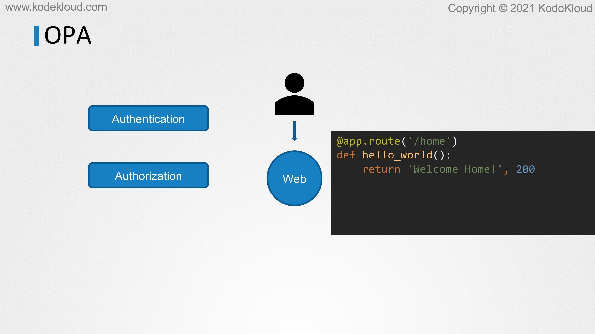<figcaption></figcaption></figure>

* In this lecture, we will take a look at open policy agent or OPA. Let's start by talking about OPA and to begin with, we will just focus on playing OPA and keep everything else like Docker or Kubernetes out of it.
* Let's talk about a simple setup where we have a web service running, where users connect to order their products.&#x20;
* When it comes to security, we know that the communication between the user and the web portal has to be secure
* For example, the users must have the correct permission to access their portal on the webserver and view their past orders or view their status, make new purchases, et cetera.
* Now we know that there are multiple phases in security. One is where the users enter their username and password to log into the system and that is authentication.
* When the communication is between two services and then this is usually achieved using certificates. That is authentication and that is not our topic of discussion here. Once they're authenticated, what can they do is defined by authorization. Now, what APIs can they access and what actions can they perform? That is what we are concerned about here. That's what OPA takes care of. Keep that in mind.
* This has nothing to do with usernames or passwords or certificates. Anything to do with OPA happens after that. We assume that at this point, whatever authentication mechanism configured has verified that the user is who the user says, he or she is. Now that the user is authenticated what areas of application is he or she allowed to access?
* &#x20;Let's first see how it is done without OPA and then we will see how it's done with OPA.
* Here we have a code of my web application. It's the simplest Python-based flask application ever. It serves a URL/home and it returns the message welcome home. Now it does not have any kind of authorization for now. That would mean anyone can access this application.

<figure>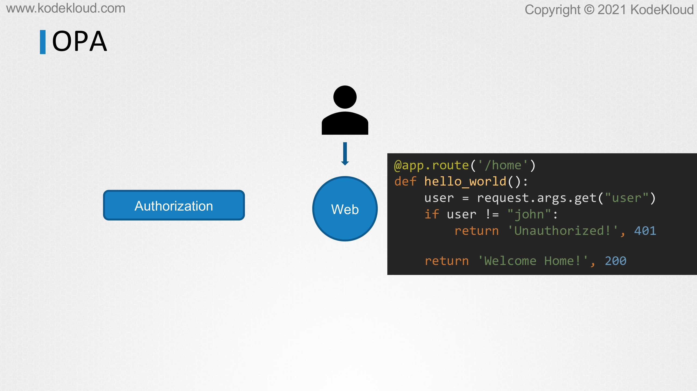<figcaption></figcaption></figure>

* I want to add a basic authorization where I check if the user is John, and only allow access to the homepage if that's the user. For this, let's say, for example, we pass in the username as a URL parameter, and we add a small check in the code to check whether the user's name is John. If not, we return an unauthorized error message. Now, this is the most simplest implementation of authorization.
* Of course, there are frameworks to do this in a much better way in flask. The user details usually come in through a header token or some session cookie, but we're just going to keep it super simple for now, as I want this to be understood by non-developers as well.
* Now, I have my simple authorization written, and this could get really complex when there are many users involved in groups and roles, and we want different access restrictions for different groups of users.

<figure>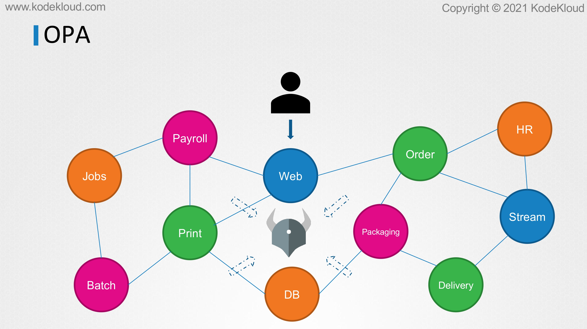<figcaption></figcaption></figure>

* It gets especially difficult when there are hundreds of services in your infrastructure and they all want to talk to each other. Each of these services might be developed in different languages like Java C, Node JS, and whatnot.
* &#x20;The details about the different authorization policies will need to be educated to all of the developers working on the services.
* Then it has to be coded and built into these applications. That's a tedious task. That's where OPA comes in. Now, you deploy OPA in your environment and then you configure policies in it and all services now reach out to OPA for authorizing that request.
* OPA then verifies the request and returns an allowed or denied message which the service then processes the request.
* Let's take a look at how that works in the context of the example that we were talking about.

<figure>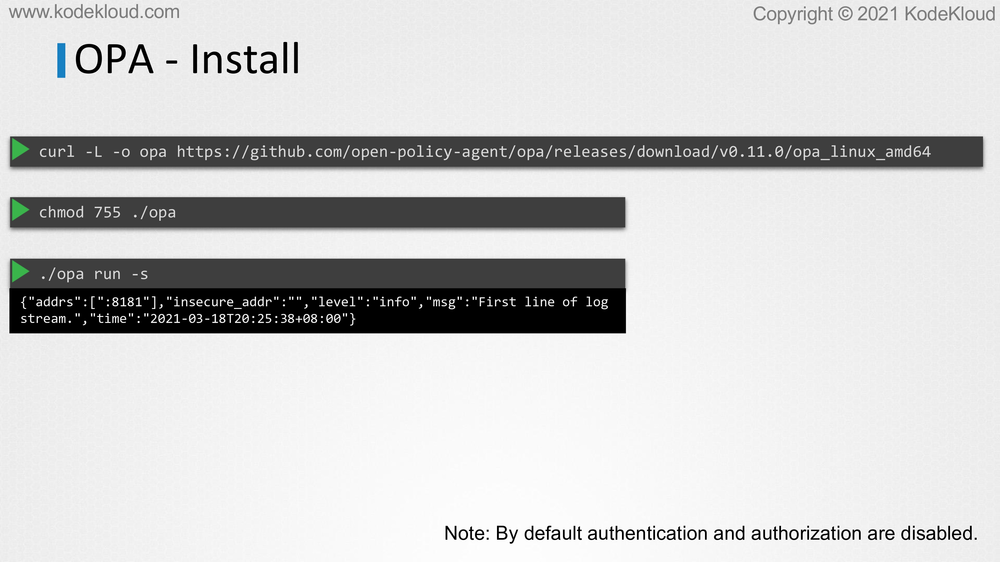<figcaption></figcaption></figure>

* Let's first look at how to get started with OPA. The first step is to deploy OPA in your environment, and this can be done by downloading the OPA binary and making it an executable and then running it with the -s flag to run as a server.
* Now it runs on port 8181 by default. Also, note that by default authentication and authorization mechanisms are disabled in OPA.
* When you're running as a server like this, of course, there are options to enable them, but I just wanted to highlight.
* We now have an OPA server running and the next step is to load policies in it. In this case, we want to load a policy that allows requests to the home URL path and by the user, John. Now, policies are defined in OPA with the language called rego. The filename extension is .rego.

<figure>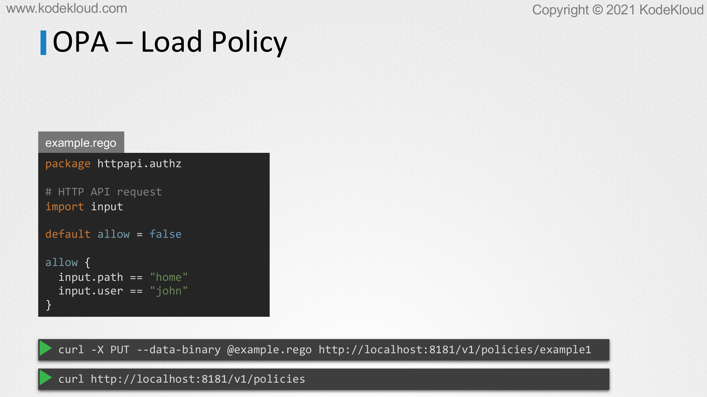<figcaption></figcaption></figure>

* Here's a sample file. The package name is httpapi.authz with an import input. Input contains all the data that will be passed to the OPA as input from other services when they make a call to OPA. In our case, our Python application is going to pass in this input. We then define a default variable called allow to false. It is by default set to false. This is what we will be returned by OPA to the caller.
* Then we have our policy validation checks within the braces. Allow, will be set to true if input.path is home and input.user is John.
* Every line within the braces is a condition and all those conditions need to be true.
* It's like an and operation, and you can have as many conditions as you want inside that and all of those conditions will need to be true if allow is to be set to true. Once the policy is ready, it can be loaded into OPA using an API request.
* In this simple example, we use curl and we use the put request and provide the policy file using the data binary flag, followed by the file name, and target the V1/policies API like this. That we'll get this policy within OPA.
* To view a list of existing policies view of the V1/policies API using curl like this. Let's bring back our application Python code.

<figure>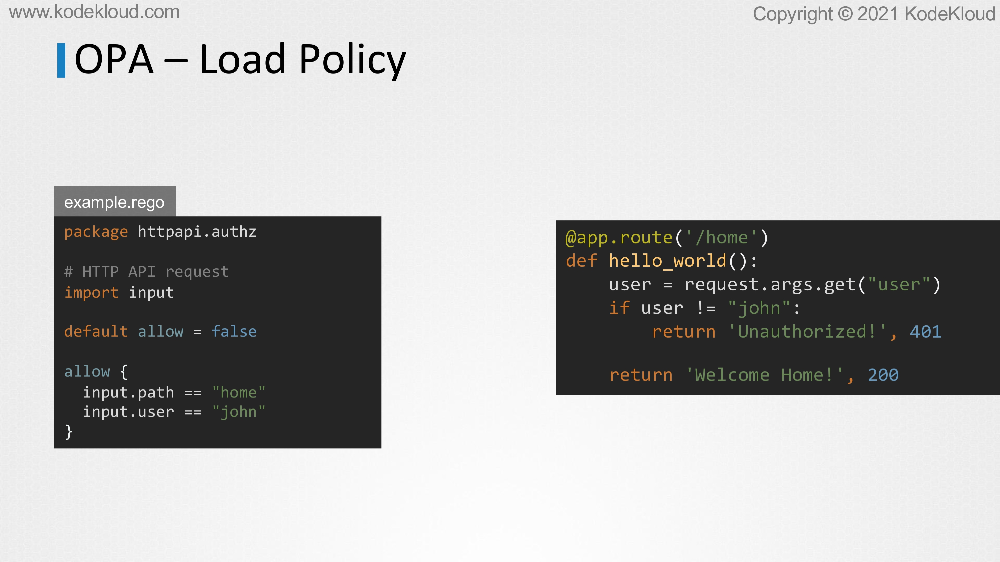<figcaption></figcaption></figure>

* Instead of us coding the logic within the application, we can now remove that and instead call OPA.

<figure>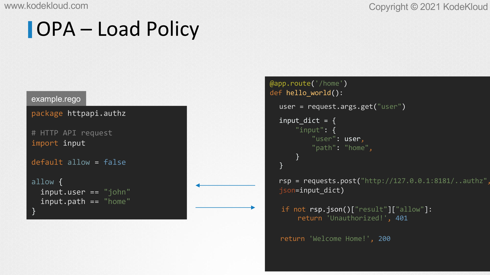<figcaption></figcaption></figure>

* I've now removed the logic of that check from my Python application. Then what we're going to do is we're first going to form an input dictionary that will be passed to OPA and then we make a post curl to the port running OPA. In this case, it's running on my own host at port 8181.
* Then we pass in the input as a Jason dictionary data element. OPA now verifies the request and responds with a result object that has the allow property.
* If the allow property is set to false, we reject the request with an unauthorized error message like this, and if it's set to true, the request is authorized.
* That's the most simplistic form of how OPA can be implemented. Now, of course, there are OPA libraries for Python and other languages that makes this implementation easier, but this is the gist of it.

<figure>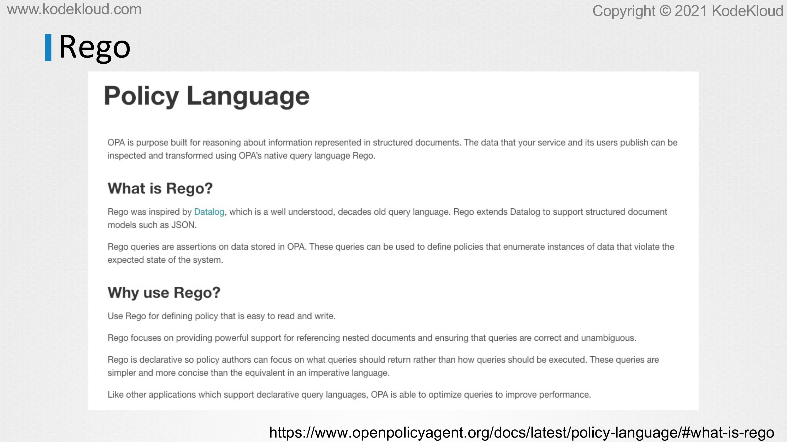<figcaption></figcaption></figure>

* There is a comprehensive guide on the Rego policy language available on the Rego website with a lot of good examples. If you're interested in learning more, I'd recommend checking that out.

<figure>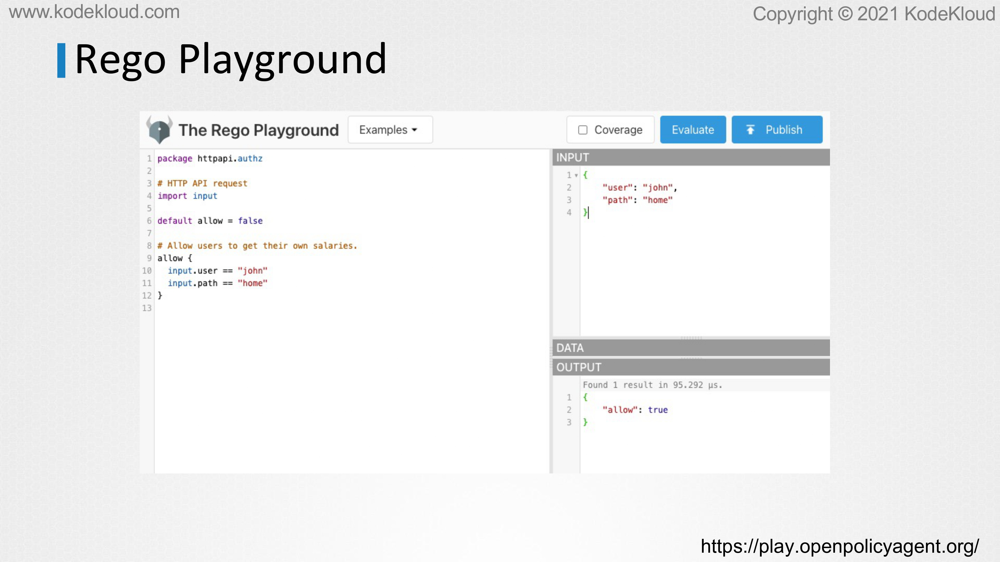<figcaption></figcaption></figure>

* Also, there's a Rego playground where you can practice working with regular policy language and evaluate and test your policies with sample input data.

<figure>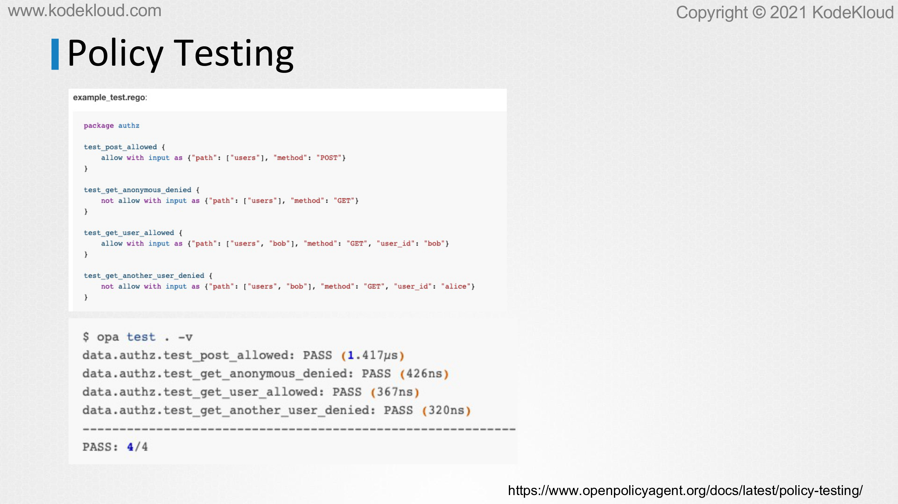<figcaption></figcaption></figure>

* Now, OPA also provides a policy testing framework to help you verify the correctness of your policies. You may write your tests in Rego file as well, and then use the OPA test command to test your policies against the number of predefined inputs. Well, that's about it on OPA for now. That's a brief introduction.
* From an exam perspective, I do not think that you will be asked to write OPA policies in Rego files because that requires you to learn a new language and I don't think they would do that as we think that it may be a bit outside of the exam curriculum. However, if you were given a policy file, then you should be able to work with it and you should be able to know what it does. We will discuss how OPA integrates with Kubernetes in the upcoming lectures. I think that that's where our focus should be with respect to the exam.

<figure>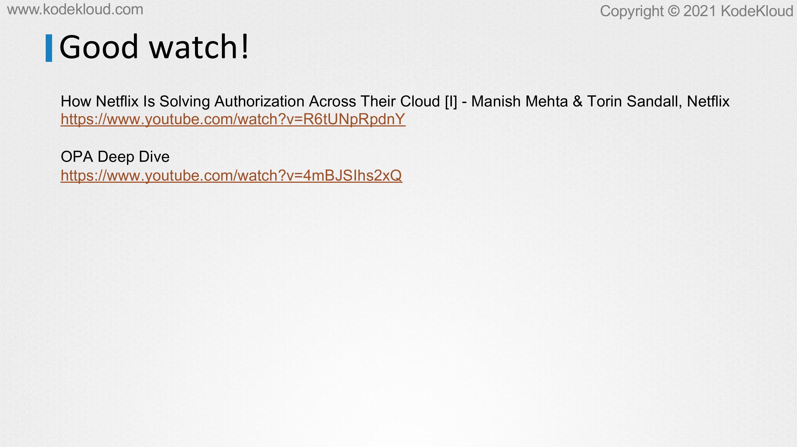<figcaption></figcaption></figure>

* There are some good talks from past KubCon events about OPA and how Netflix is solving authorization across their cloud by Manish Mehta and Torin Sandall, and an OPA deep dive from its founders. I'd recommend checking them out if you're interested in learning more and getting a deep dive into OPA well, that's it for now, head over to the labs and practice working with OPA, and I will see you in the next lecture.
