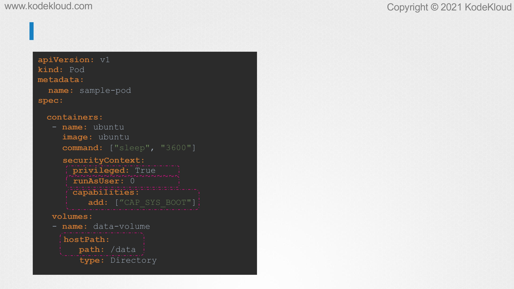
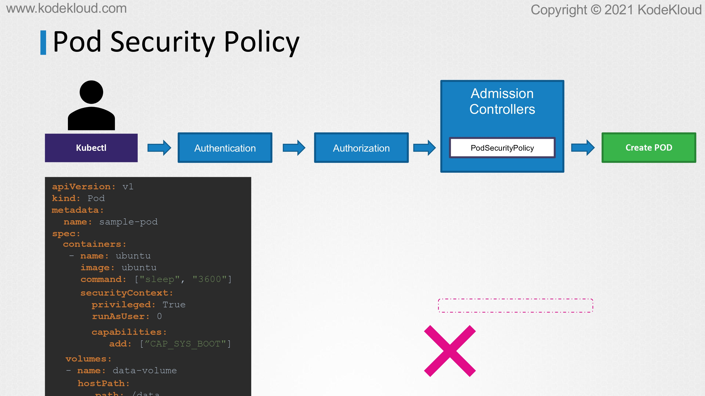
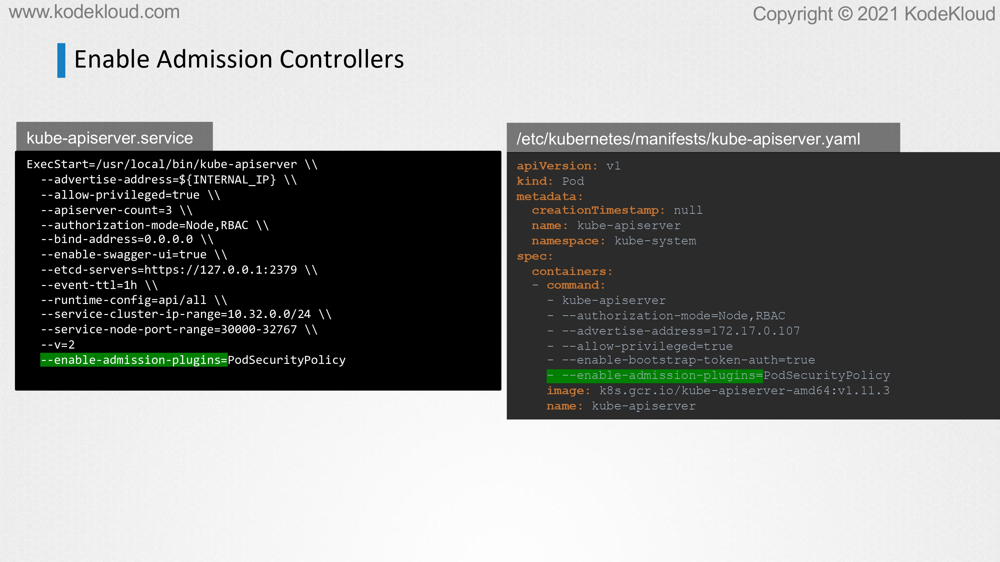
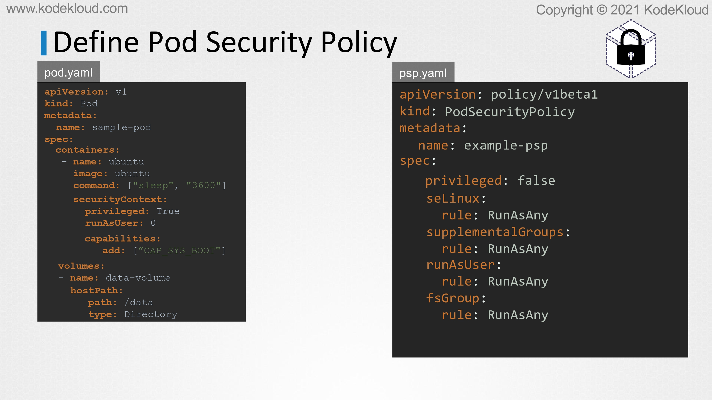
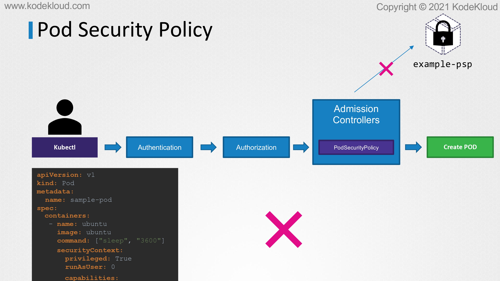
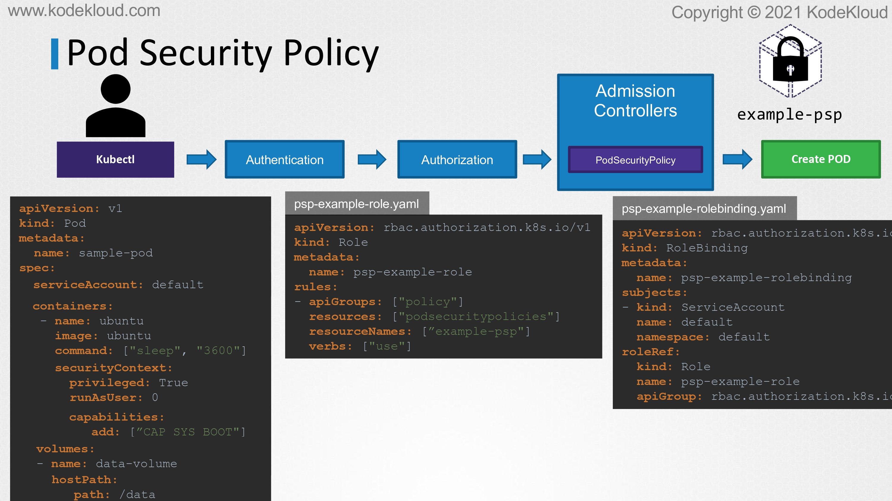
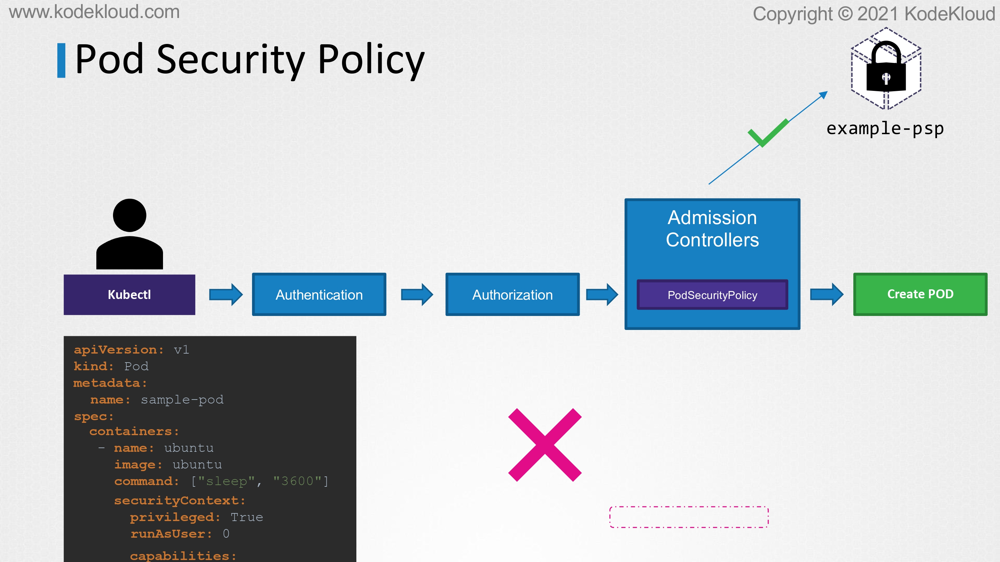
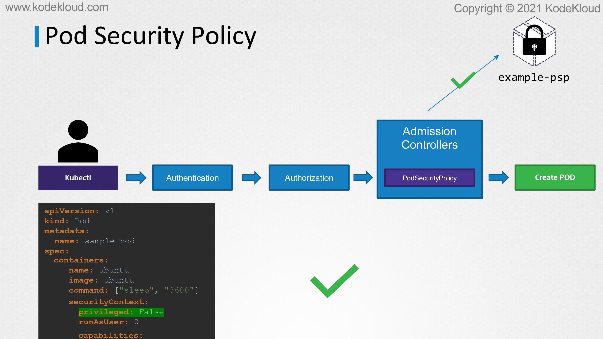
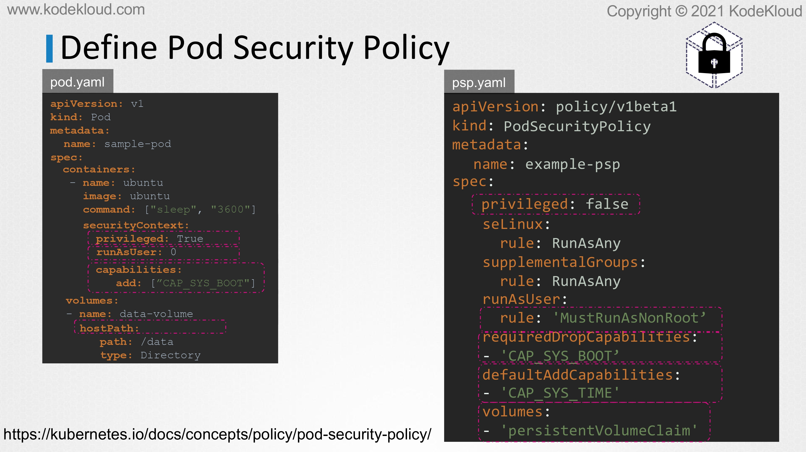
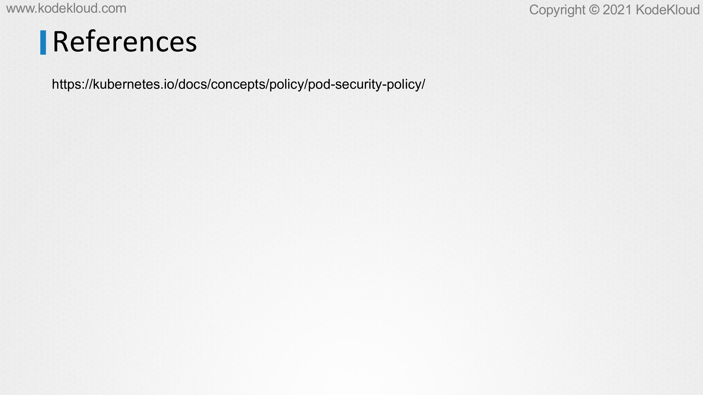

# Pod Security Policies

<figure><figcaption></figcaption></figure>

* In this lecture, we'll take a look at Pod Security in Kubernetes. Let's take this Pod definition file, for example. It is used to create a pod with an Ubuntu image.
* It has a number of configurations that we might not want to allow users to perform on our cluster. For example, under the SecurityContext section, we have the privileged flag set to True. This will allow the processes running inside the Pod to have root privileges on the host.
* The container is configured to run as User zero, and that is the root user. And we have capabilities added to the cluster. We have volume mounts configured to use hostPath. And all of these can make your container vulnerable to Attack.&#x20;
* So,we may want to crate policies that prevent users from creating containers with certain configurations.

<figure><figcaption></figcaption></figure>

* And that's where the concept of pods security comes in.&#x20;
* Pod Security helps us implement policies to restict Pods from being created with specific capabilities or privilegs.
* The original implementation of Pod Security was through what was known as Pod Security policies.
* This was removed as of version 1.25 in Kubernetes, and is replaced by Pod Security Admission and Pod Security Standards, which was promoted to being stable in version 1.25.&#x20;
* Now, because Pod Security Policy was the original implementation, and you're going to see that mentioned in many places on the web, and you might even come across implementations of it. If you were working on older clusters, it is important to have a basic idea of how it works.&#x20;
* Before we dig into the new methods of power security admission, so, in this chapter, we're going to take a brief look at what Pod Security policies were. And that Will help us easily understand and transition into Pod Security Admission in the next lecture.
* So, let's start by looking at what Pod Security policies are first.

<figure><figcaption></figcaption></figure>

<figure><figcaption></figcaption></figure>

* So, at a very high level, how Pod Security policies work is that when it is enabled, the Pod Security Policy admission controller observes all pod creation requests and validates the configuration against the set of pre-configured rules. And if it detects a violation of the rule, then that request to create the pod is rejected and the user receives an error message.As simple as that.

<figure><figcaption></figcaption></figure>

* Now, the Pod Security Policy is deployed as an admission controller. So, to enable Pod Security Policy, we add it to the enable admission plugins flag on the API server as shown here.

<figure><figcaption></figcaption></figure>

* And, next, we create a Pod Security Policy object defining our Pod Policy requirements.
* In this case, we don't want to allow creating containers with privileged flags set to True. So, we create a Pod Security Policy with the API version, kind, metadata, and spec.
* The apiVersion used to be policy V1beta1, kind is Pod Security Policy. Metadata has a name, example-psp, and then under spec, we have the privileged flag set to False. So, this will reject all pod creation requests with the privileged flag set to True.
* And there are some required fields such as SeLinux, runAsUser, etc. For now, these are all just set to RunAsAny, which essentially allows the pods to be created with any of these flags.
* We then create this object to create the Pod Security Policy definition.

<figure><figcaption></figcaption></figure>

* And, let's say, if you wanted to customize the policy to disallow privileged containers, set the privileged option to False, and to disallow run as root user, set the runAsUser rule to must run as non root, and to disallow certain capabilities, we add the required capabilities and provide a list of capabilities that must be dropped.
* And you may use the default add capabilities to provide a list of capabilities that must be added by default. So, those listed here will be added to the Pod definition automatically.
* And this indicates that Pod Security policies are not only used to verify and approve or reject pod creation requests, but they can also change or mutate the pod definition by adding certain default value.
* So, this is important to note because later when we talk about how PSAs and, you know, a pod security had this particular feature of mutating the Pod definition is not actually available in those. So, this is something that was only available in the Pod Security policies and is no longer available.
* And we'll also see how it can be done with third-party tools for complicated requirements.
* And the last thing is to ensure host path volumes are not set, define a set of allowed volume types under volume section within the pod security policy.

<figure><figcaption></figcaption></figure>

* So, now that we have the Pod Security Policy admission controller enabled and the Pod Security Policy object created with our rules in it, the next time a request comes in, the Pod Security Policy admission controller will try to query the Pod Security Policy's object to look for rules to deny or approve the request.
* However, if you have only enabled the admission controller and not authorized security policy's API, then the admission controller will not be able to communicate with the Pod Security Policy's API and thus reject all requests.
* So, even if the requests are valid, remember that, as soon as the Pod Security Policy admission controller is enabled, it'll start denying all requests to create a pod.
* So, keep that in mind because it's also one of the drawbacks of how Pod Security policies were implemented in the past, which made it hard to roll out Pod Security policies to existing working clusters.
* So, the entity that is trying to create a pod in this case, a user or the pod itself, must have access to the Pod Security Policy API.
* So, how do we do that and how do we give one object access to an API in Kubernetes?

<figure><figcaption></figcaption></figure>

* So, if we've learned that this can be done using role and role-based access controls in the past. So, again, don't worry if you don't fully follow these.
* I'm just sharing this to show you how complicated it was to roll out Pod Security policies in the past.
* So, just to go over this real quick, so every pod when created has a service account associated with it, even if you don't specify one explicitly.
* The service account named default in the namespace that the pod belongs to is assigned to the pod. So, to authorize the pod with the pod security policy, we create a role and bind it to the default service account in that namespace.&#x20;
* So, the role is named PSP-example-role and is configured with access to use the API Pod Security policies under the policy API group with the resource name example-PSP. And that's the name assigned to the Pod Security Policy that we created.&#x20;
* Next, we create a role binding to bind the role to the default service account. In our case, we are in the default namespace. The namespace would also be default, and these role and role bindings will ensure that the Pod Security policies are authorized.

<figure><figcaption></figcaption></figure>

* Okay, so, now that the appropriate role binding is set when the pod creation request comes in, the admission controller can now authorize through to the Pod Security policies that we created. And since we have disabled the use of privileged flag, the request is denied.
* So, that's a valid way to deny that request because it was actually not supposed to create pod with privileged flag set to True.

<figure><figcaption></figcaption></figure>

* However, if we were to send a request with the privileged flag set to False, then we'll see that that particular request is approved.
* So, eventually, we got it fully working with the way that we wanted it to work.

<figure><figcaption></figcaption></figure>

* Okay, so, just to summarize, so that's all about PSPs that we're going to discuss. Now, PSPs had some inherent challenges and complexities, some of which we have already seen. So, first of all, it was not enabled by default, and users had to spend extra effort in enabling the plugin and configuring it to work.

<figure><figcaption></figcaption></figure>

* We talked about how we can define Pod Security policies for different requirements. So, if you were to enable Pod Security policies in a cluster, you have to make sure that appropriate policies are created in advance for all the requirements before it's enabled. If you don't do that, all requests to create pods would be denied.
* So, this made it a pain to roll out PSPs to existing clusters.

<figure><figcaption></figcaption></figure>

* We also discussed that as soon as it's enabled, it is going to deny all requests to create pods because the required rules aren't created.&#x20;
* So, we must create a role and role bindings to the user or service accounts to get it to work. And this approach of binding the PSP to a specific user or account breaks other entities that create pods such as controllers, like deployments or application controllers. And, eventually, users started creating different policies for different requirements that resulted in a big mess, and this led to a lot of complexity and the inability to track what's where.&#x20;
* So, all of these led to the deprecation of PSP in version 1.21, and the further removal of it in version 1.25, and the introduction of a much more simpler approach known as Pod Security Admission, which we'll discuss in the next lecture.

<figure><figcaption></figcaption></figure>
