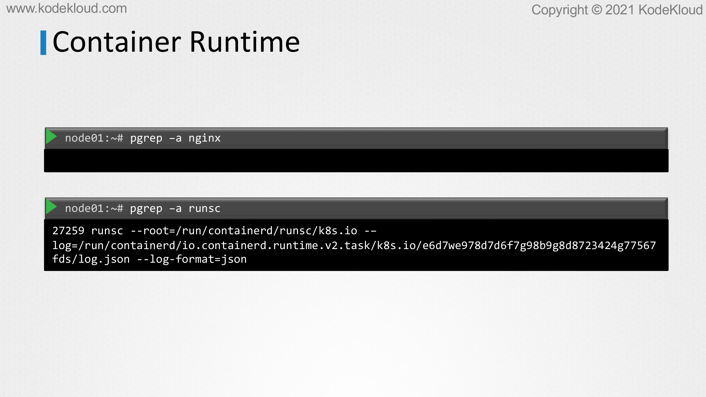

# Runtime Classes

<figure><figcaption></figcaption></figure>

* Now that we know the basics of containers and boxing tools such as gVisor and Kata containers, let us see how to make use of them to deploy containers.&#x20;
* Let's take a step back and take a look at the high-level steps that occur when we run a container. For example, when we run the Docker run nginx command, Docker first pulls the latest image of Nginx if it's already not present on the server, and then it starts the container.
* What happens under the hood to make this possible?

<figure><figcaption></figcaption></figure>

&#x20;&#x20;

* Let's take a quick recap. When we execute a command using the Docker CLI to create a container, the Docker client converts the command into a restful API which is then passed to the Docker daemon.&#x20;
* The Docker daemon, on receiving the instruction, first checks if the image provided is already available on the local system.&#x20;
* If it's not, the image is downloaded from the Docker registry, the default being Docker hub. Once the image is downloaded, it makes a call to the containerd to stop the container. Containerd is responsible for converting the image into an OCI compliant bundle. It then passes the bundle to the containerd-shim, which in turn calls the container runtime, the runC, to start the container.&#x20;
* RunC interacts with the new spaces and CGroups on the kernel to create a container. Let us now turn our attention to runC, which is the default component in charge of actually creating the containers.&#x20;
* It is also referred to as the default container runtime that adheres to the standards defined by the OCI, which is the Open Containers Initiative that specifies standards around container formats and runtime.

<figure><figcaption></figcaption></figure>

* With runC installed on a server, we can now run containers without using Docker by making use of the runC CLI.&#x20;
* However, without the features provided by Docker such as image, volume, and network management, it would be difficult to manage the lifecycle of this container.&#x20;
* RunC is also the default runtime which is used by other container tools such as Podman and CRI-O. However, there are other container runtimes out there besides runC.

<figure><figcaption></figcaption></figure>

* The containers sand boxing technologies such as Kata containers and gVisor that we saw in the previous lecture, use a completely different runtime as compared to Docker.
* &#x20;Kata containers use kata-runtime under the hood and gVisor uses another runtime called Runsc to create the containers.

<figure><figcaption></figcaption></figure>

<figure><figcaption></figcaption></figure>

* Because these runtimes are OCI-compatible, we can run Kata containers or gVisor containers using Docker CLI like this.&#x20;
* Here we're making use of the runtime option while running a container and we are specifying the name of the decide container runtime.&#x20;
* That's it for this lecture. In the next video, we will learn how to install gVisor on Kubernetes nodes and use it to create sandbox containers inside Kubernetes pods.
