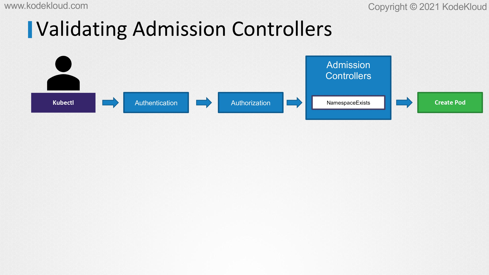
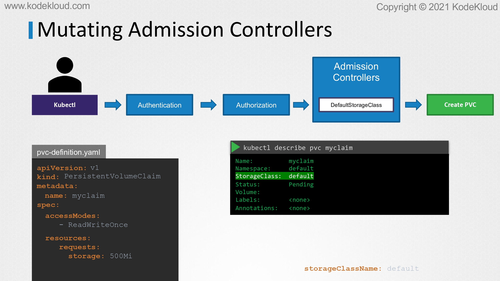

# Validating and Mutating Admission Controllers

<figure><figcaption></figcaption></figure>

* In this lecture, we will take a closer look at the different types of admission controllers and how we can configure our own admission controller. We looked at the NamespaceExists or NamespaceLifecycle admission controller. It can help validate if a namespace already exists and reject the request if it doesn't exist. This is known as a validating admission controller.

<figure><figcaption></figcaption></figure>

* Let's look at another type of admission controller plugin named the DefaultStorageClass plugin. This is a plugin that is enabled by default. Say, for example, you are submitting a request to create a PVC, the request goes through authentication, authorization, and finally the admission controller.&#x20;
* The DefaultStorageClass admission controller will watch for a request to create a PVC and check if it has a storage class mentioned in it. If not, which is true in our case, it will modify your request to add the default storage class to your request.&#x20;
* This could be whatever storage class is configured as the default storage class in your cluster. When the PVC is created and you inspect it, you will see that a StorageClass default is added to it even though you hadn't specified it during the creation. This type of admission controller is known as a mutating admission controller.
* It can change or mutate the object itself before it is created.

<figure><figcaption></figcaption></figure>

* Those are two types of admission controllers. Mutating admission controllers are those that can change the request, and validating admission controllers are those that can validate the request and allow or deny it.&#x20;
* There may be admission controllers that can do both, that can mutate a request as well as validate a request. Now, generally, mutating admission controllers are invoked first followed by validating admission controllers.&#x20;
* This is so that any change made by the mutating admission controller can be considered during the validation process. In this example, the NamespaceAutoProvisioning admission controller which is a mutating admission controller is run first, followed by the validating controller NamespaceExists.&#x20;
* If it was run the other way, then the NamespaceExists admission controller would always reject the request for a namespace that does not exist and the NamespaceAutoProvisioning controller would never be invoked to create the missing namespace.&#x20;
* When a request goes through these admission controllers, if any admission controller rejects the request, the request is rejected and an error message is shown to the user.&#x20;
* Now, these are all built-in admission controllers that are part of the Kubernetes source code and are compiled and shipped with Kubernetes.&#x20;
* What if we want our own admission controller with our own mutations and validations that has our own logic?
* To support external admission controllers, there are two special admission controllers available, MutatingAdmissionWebhook and then ValidatingAdmissionWebhook. This is what we will look at next.

<figure><figcaption></figcaption></figure>

* We can configure these webhooks to point to a server that's hosted either within the Kubernetes cluster or outside it.&#x20;
* Our server will have our own admission webhook service running with our own code and logic. After a request goes through all the built-in admission controllers, it hits the webhook that's configured.&#x20;
* We will see how to configure that in a bit. Once it hits the webhook, it makes a call to the admission webhook server by passing in an admission review object in a JSON format.&#x20;
* This object has all the details about the request such as the user that made the request, and the type of operation the user is trying to perform and on what object, and the details about the object itself.
* &#x20;On receiving the request, the admission webhook server responds with an admission review object with a result of whether the request is allowed or not. If the allowed field in the response is set to true, then the request is allowed, and if it's set to false, it is rejected.&#x20;
* How do we set this up? First, we must deploy our admission webhook server which will have our own logic, and then we can configure the webhook on Kubernetes by creating a webhook configuration object.

<figure><figcaption></figcaption></figure>

* Let's take a look at each of these steps next. The first step is to deploy our own webhook server. This could be an API server that could be built on any platform.&#x20;
* An example code of a webhook server written in Go can be found here in the Kubernetes documentation pages, it's written in the Go programming language. You could develop your own server in other languages as well if required.
* The only requirement is that it must accept the mutate and validate APIs, and respond with a JSON object that the webserver expects.

<figure><figcaption></figcaption></figure>

* Here is a pseudo-code of a sample webhook server written in Python. There are two calls, a validate call and a mutate call. The validate call receives a validation webhook request, and in this example, compares the name of the object and the name of the user who sent the request and rejects the request if it's the same name. Just a simple example use case to show what we can do with the requests that come in.

<figure><figcaption></figcaption></figure>

* &#x20;If you look down, we'll see the mutating webhook which gets the username and responds with a JSON Patch operation of adding the user name as a label to any request that was raised by anyone.

<figure><figcaption></figcaption></figure>

* If you take a closer look at this particular piece of code, a patch object is a list of patch operations with each operation being, add, remove, replace, move, copy, or test. We then specified the part within the JSON object that needs to be targeted for change. In this case, it is /metadata/labels/users and then the value that needs to be added if it is an add operation. We get the user name from the request, so that's going to be the value of that particular label.
* This is then sent as a base64 encoded object as part of the response. On a side note, from an exam point of view, you will not be asked to develop any code like this, so don't worry if you don't fully understand this piece of code.
* All you need to take away from this is that the admission webhook server is a server that you deploy that contains the logic or the code to permit or reject a request, and it must be able to receive and respond with the appropriate responses that the webhook expects.
* This is just a simple example to show what kind of things you can do and what kind of things you can code and implement in the webhook server that you deploy.

<figure><figcaption></figcaption></figure>

* Moving on, once we have developed our own webhook server, the next step is to host it. We either run it as a server somewhere or containerize it and deploy it within the Kubernetes cluster itself as a deployment. If deployed as a deployment in a Kubernetes cluster, then it needs a service for it to be accessed, so we have a service named webhook service as well.

<figure><figcaption></figcaption></figure>

* The next step is to configure our cluster to reach out to the service and validate or mutate the requests.&#x20;
* For this, we create a validating webhook configuration object.&#x20;
* We start with the apiVersion, kind, metadata, and webhooks section: apiVersion is admissionregistration.k8s.io/v1, kind is ValidatingWebhookConfiguration.&#x20;
* If we are configuring a mutating webhook, this would be a MutatingWebhookConfiguration. We then give it a name.&#x20;
* Now under webhooks, we configure the different webhooks, so a webhook has a name, a clientConfig, and a set of rules.&#x20;
* The name we set it to pod-policy.example.com, the clientConfig is where we configure the location of our admission webhook server. I
* f we deployed the server externally on our own, that is not a part of a deployment in Kubernetes cluster, then we can simply provide a URL path to that server like this.&#x20;
* Instead, if we deployed the server as another service on our own cluster as it is on the left, then we can use the service configuration and provide the namespace and name of the service, which in our case, is webhook-service.&#x20;
* Now, of course, the communication between the API server and the webhook server has to be over TLS, so a certificate bundle should be configured.&#x20;
* The server has to be configured with a pair of certificates, then a certificate caBundle is to be created and pathed into this clientConfig as a caBundle.&#x20;
* Next, we must specify when to call our API server. We could specify rules to configure exactly when we want our webhook server to be called for validation. We might not want to do that for all of the calls.&#x20;
* For example, we may only want it to be called while creating pods, deleting pods, or creating deployments, et cetera.&#x20;
* Whatever that may be, it can be added as a rule under the rules section using apiGroups, apiVersions, operations types, and resources.&#x20;
* In this example, we're only going to call this webhook configuration when calls are made to create pods, and that should be it. Once this object is created, every time we create a pod, a call would be made to the webhook service and depending on the response, it would be allowed or rejected.
