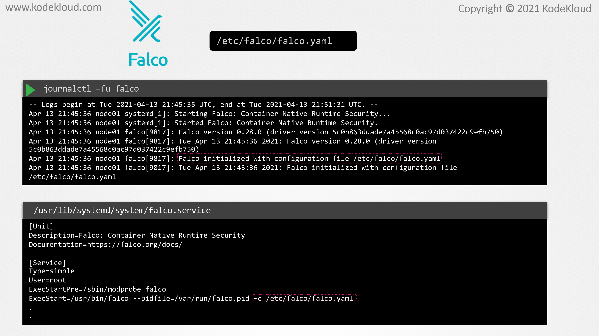
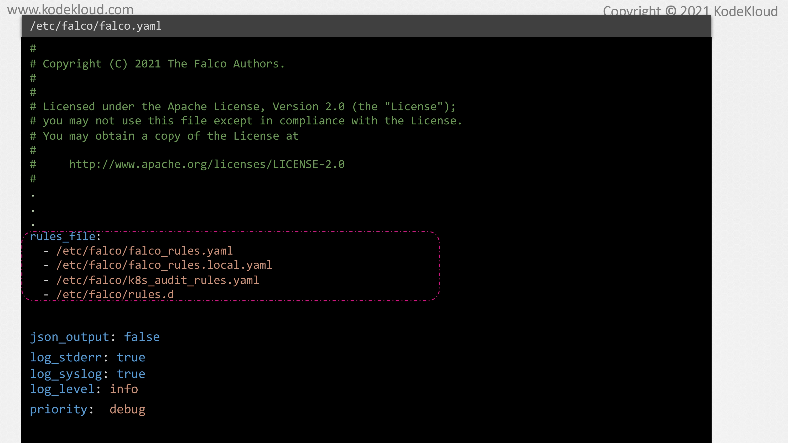
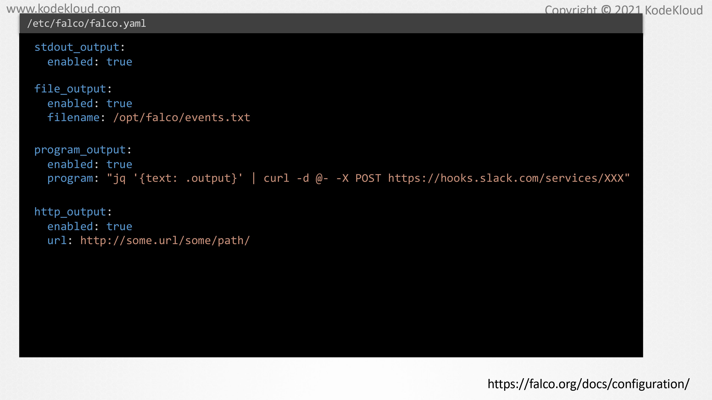
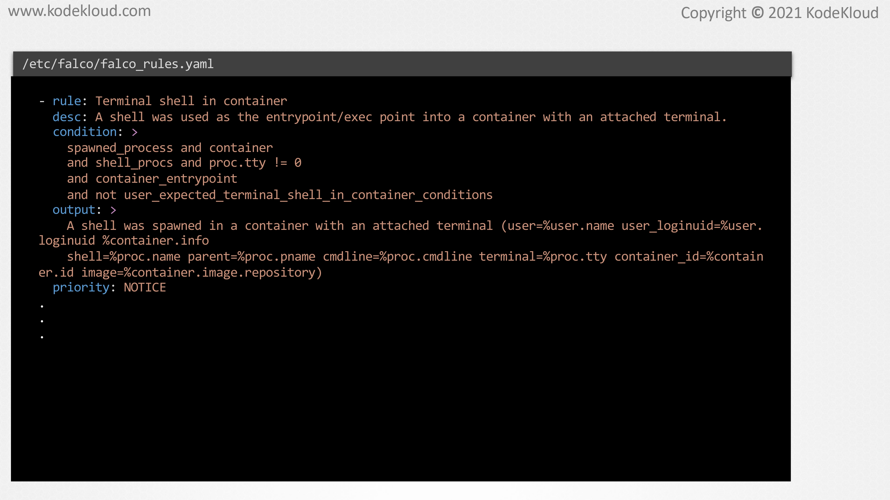
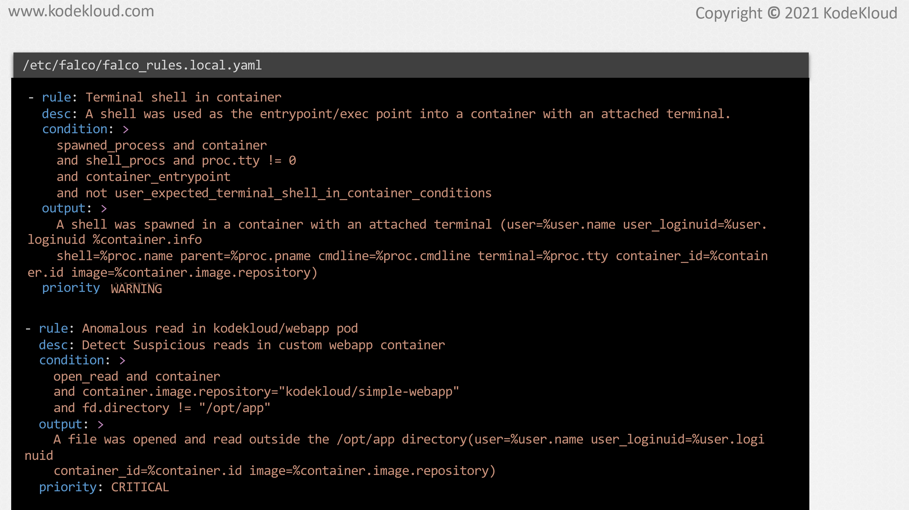
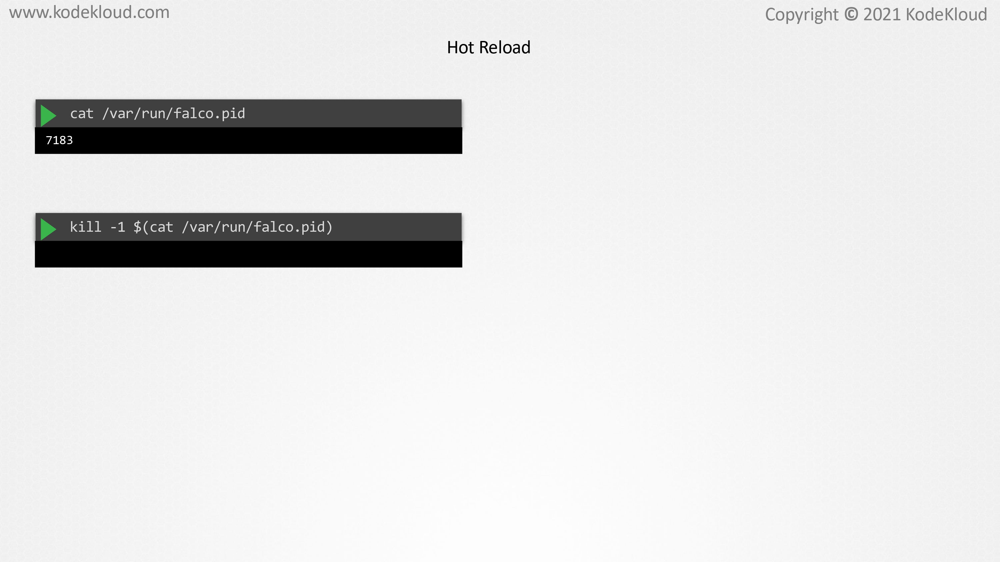

# Falco Configuration Files

<figure><figcaption></figcaption></figure>

* In this lecture we will take a look at the configuration files using Falco and see how to update existing rules and add custom rules of our own. In the previous lecture we learned how to write simple rules in Falco, but where are these rules configured and how do they run? The main Falco configuration file is the YAML file which is located at /etc/falco/falco.yaml.
* &#x20;It is this configuration file that Falco uses when it starts up. This can be seen by either inspecting the service unit file for Falco or by checking the Falco logs using the general CTO command on the node. In fact, if we inspect this service unit file used by Falco, we can see that, by default, it runs the Falco command with the -c flag, which uses this configuration file.

<figure><figcaption></figcaption></figure>

* This YAML file consists of all the configuration options used by Falco, such as the location of the rules that it uses, various formatting options used for log and output messages, the output channels to be configured, et cetera.&#x20;
* There are several configuration options that are available for use within this configuration file. Let's check out a couple of the commonly used ones.
* &#x20;First, let's look at how rules are loaded by Falco. For this, the Falco configuration file uses our rules\_file field which accepts a list of files containing rules like this. The built-in rules that we saw in action in the previous lecture are stored inside this /etc/falco/falco\_rules.yaml file. You can see that it is first in this list.&#x20;
* The order in which the rule files are declared in this list is important. If the same rule is available in all of these files, the one and the last file overrides those in the proceeding files. We will take a closer look at the falco\_rules YAML file in a bit.&#x20;
* Next, let us look at some other configuration options. The json\_output field when enabled logs the events in json. By default, this field is set to false and the events are logged as text. Then, we have configuration options related to Falco itself, such as the login options for the Falco process, such as whether to log to standard error or to syslog, or the log level that is used for the Falco logs et cetera.&#x20;
* Now, these are not to be confused with the priority that we have used for individual rules. The log level that we have set here is specific for the logs generated by Falco itself. The priority field, however, is related to Falco rules.
* &#x20;This is the minimum priority level that Falco will use to log events. Anything higher than this priority will be logged, and anything under the set priority will not be logged by Falco. The default is set to debug, which we only know as the lowest priority available. This means that every event will be logged by default.

<figure><figcaption></figcaption></figure>

* Next, let's take a look at the output channels that can be configured. By default, Falco logs events to the standard output. However, multiple output channels can be enabled.&#x20;
* To log events to a specific file, we can make use of the file output field and set enabled to true. We also have to pass in the file name where we want the events to be written.&#x20;
* By enabling program output, we can send Falco events to external programs such as a Slack Webhook. Alternatively, we can also send the events to an HTTP endpoint by making use of the HTTP output field. Besides this configuration options, there are more data available in the Falco configuration file. However, they are out of scope for this course.&#x20;
* Should you wish to explore further, please do check out the reference documentation at this link. Before we move on, it is worth noting that if you make any changes to this configuration file, for it to take effect you'll have to reload the Falco configuration and restart the engine.&#x20;
* We will see how to do that a little bit later in this lecture.

<figure><figcaption></figcaption></figure>

* Now, let us take a look at the rules files, the /etc/falco/falco\_rules.yaml is the default file that contains all the built-in rules, lists and micros.&#x20;
* The events that were generated when we opened a shell into the container and opened this shadow file were generated based on rules which are in this file.&#x20;
* As we mentioned earlier, Falco comes bundled with plenty of built-in rules that cover several situations that we would want to audit. However, we can also add our own rules or even overwrite an existing default rule.&#x20;
* While technically an existing rule can be updated directly inside the falco\_rules file and expected to work, this is not the correct approach. Any change made to the falco\_rules.yaml file will be overwritten when the Falco package is updated.

<figure><figcaption></figcaption></figure>

* Instead, the changed rule can be added to the falco\_rules.local.yaml file. Here, we have changed the priority of the rule from Notice to Warning. We can also add our own custom rules to the same file.&#x20;
* This particular rule here will generate a critical alert if a file was opened and read outside any part which is not /opt/app on a container which is created using the code cloud/simple web app image.&#x20;
* Now, for the changes to take effect, we have to reload the configuration and restart the Falco engine.

<figure><figcaption></figcaption></figure>

* One way to do this without having to restart the entire Falco service is to use the hot reload method. To do this, we need to first find the PID of the Falco process. When Falco is started by System D as a service, the PID of this process is stored inside a file, which is /var/run/falco.pid. Next, we can run the SIGHUP or the signal hangup by issuing a kill-1 against the PID of the Falco process. This will reload the Falco configuration and restart the Falco engine without restarting the Falco service. Our new and updated rules will now be in effect.
