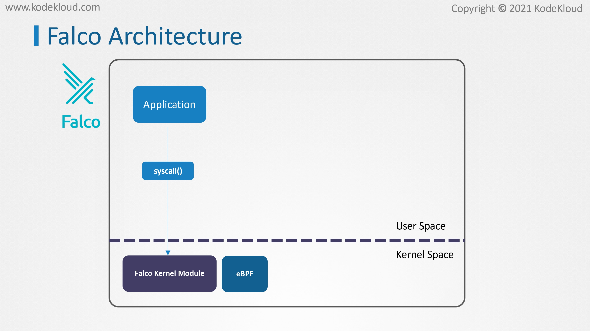
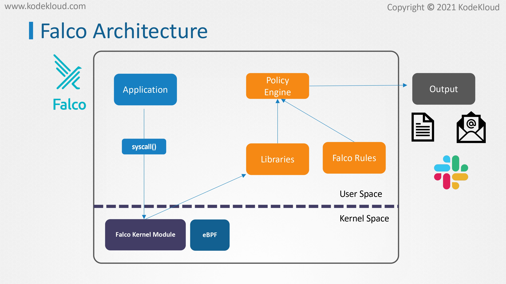
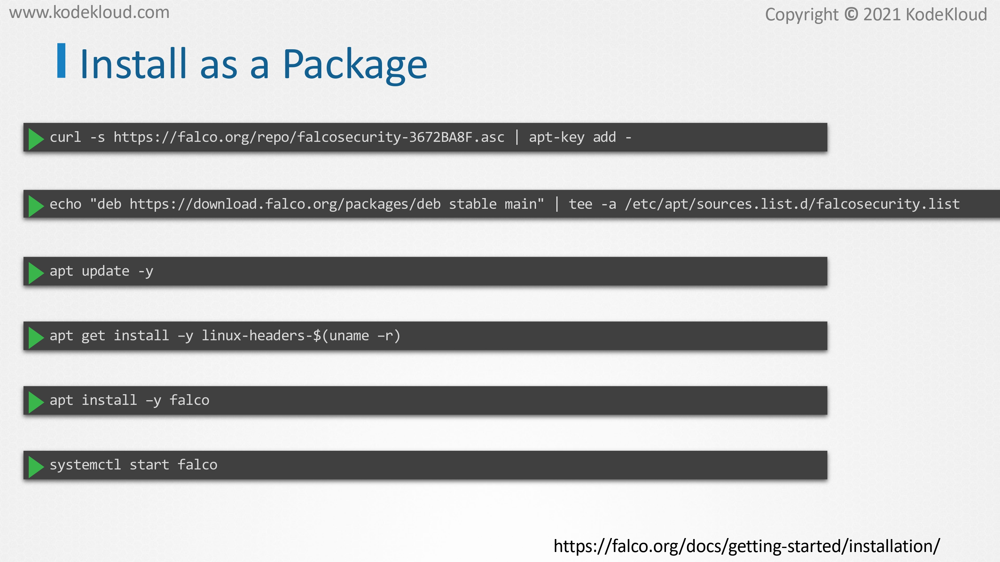
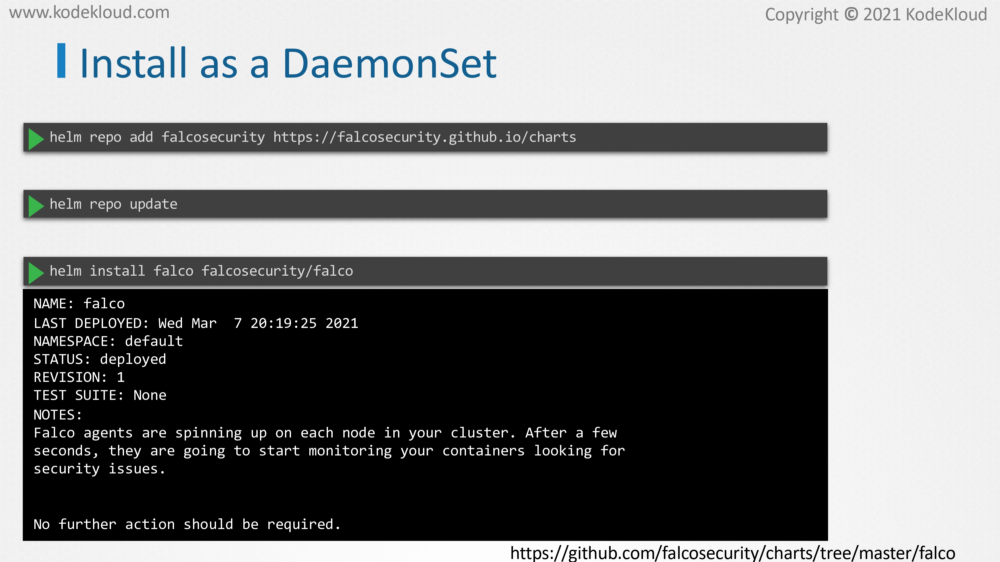
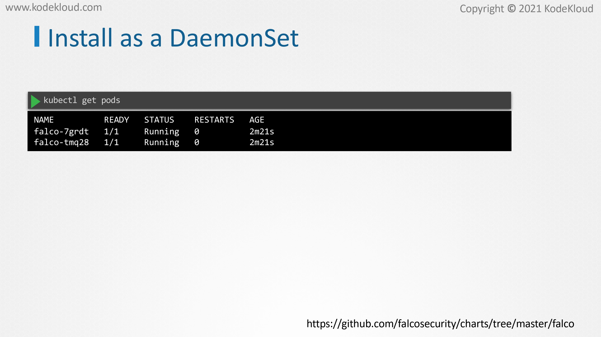

# Falco Overview and Installation

<figure><figcaption></figcaption></figure>

* WEBVTT In this lecture, we will install Falco in our Kubernetes cluster and then use it to detect and analyze threats.
* &#x20;Before we install Falco and start using it, let us take a quick look at the high-level overview of how Falco works.
* &#x20;Falco needs to see what system calls are coming through from the applications in the user space into the Linux kernel. This means that somehow, it has to insert itself into the kernel to sit in the middle and see what's coming in.&#x20;
* One way Falco does this is by making use of a kernel module. However, this basically means that we insert additional code right inside the Linux code so it's pretty intrusive. As such some manage Kubernetes service providers do not allow us to do this.
* &#x20;Falco can also interact with the kernel through what is called as EBPF or the Extended Berkeley Packet Filter.&#x20;
* We saw this briefly when we got introduced to the aqavaset tracy tool, which also uses EBPF. EBPF is somewhat less intrusive and safer. Some providers are more inclined to allow this method.

<figure><figcaption></figcaption></figure>

* The system calls are then analyzed by the cystic libraries in the userspace. The events are then filtered by the Falco policy engine by making use of the predefined rules that can detect whether the event was suspicious or not. Such an event is then alerted via various output channels, such as CIS log files, standard outputs, or alerting mechanisms such as Slack channel alerts or email alerts, et cetera.

<figure><figcaption></figcaption></figure>

* &#x20;As mentioned before, Falco needs to be able to interact with the kernel. If you installed Falco as a regular software package on the Linux operating system, this will also install the Falco kernel module.&#x20;
* To do this, use these steps provided in the Falco installation documentation like this. Once it is installed, enable and start the Falco service.&#x20;
* One major advantage of using Falco as a service on the node directly is that in case of a compromise, Falco is isolated from Kubernetes, and it can still continue to detect and alert suspicious behavior.

<figure><figcaption></figcaption></figure>

* Alternatively, if installing directly on the node is not possible, we can also run Falco as a DaemonSet on the nodes of the cluster.&#x20;
* The easiest way to deploy this demon set is by making use of hand shots. For detailed steps, please check out the reference section following this lecture.&#x20;
* Once installed, you should be able to see the Falco pause running on all nodes of the cluster and that's it. We are now ready to use Falco rules to detect and alert anomalous behavior.

<figure><figcaption></figcaption></figure>
