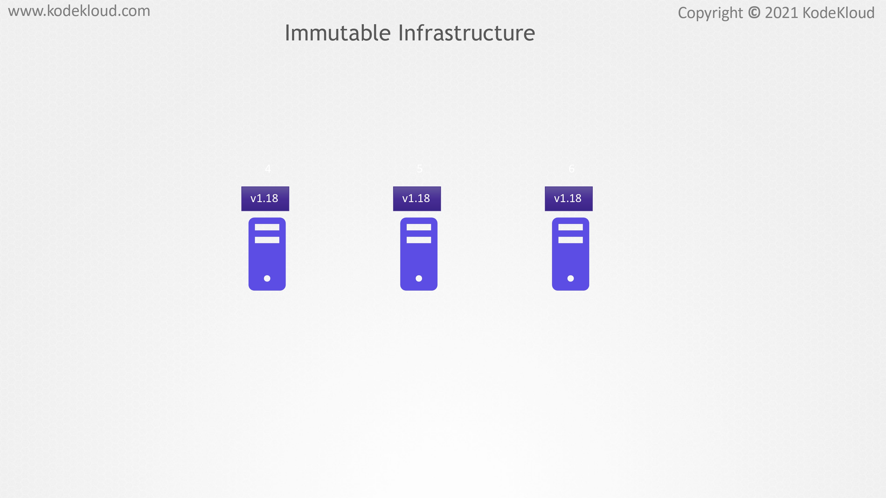

# Mutable vs Immutable Infrastructure

<figure><figcaption></figcaption></figure>

* &#x20;In this lecture, let us understand the difference between mutable and immutable infrastructure. To understand the concept of immutability, let's make use of a simple example.&#x20;
* Now, in this example, let's forget about Kubernetes and containers for a minute. Consider a web server which is running engine X with the version of 1.17 directly on a host. When a new version of engine X is released, we upgrade the software running on the server first from 1.17 to 1.18 and then to 1.19. This can be done using a number of different ways.&#x20;
* One simple approach is to download the desired version of engine X, and then use it to upgrade it manually. Of course, we can also make use of ad hoc scripts or configuration management tools such as Ansible to achieve this.

<figure><figcaption></figcaption></figure>

* Now, what if for high availability instead of just one web server, we now have a pool of three web servers all running the same software and code?&#x20;
* We would have to use the same software update life cycle for each of the servers, using the same approach as the first server.&#x20;
* You update the software version on the existing set of web servers from an older version to a newer version.&#x20;
* Now, this type of update is known as in-place updates. This is because the underlying infrastructure remains the same, but the software and the configuration on these servers have been changed as part of the update. This setup here is an example of mutable infrastructure.

<figure><figcaption></figcaption></figure>

* Updating software on a system can be a complex task. In almost all cases, there are a set of dependencies that have to be met before an upgrade can be carried out successfully. For example, let us say that web server 1 and 2 have every dependency met while upgrading them from 1.17 to 1.19. These two servers get updated to 1.19 without any issues.&#x20;
* We have server three, on the other hand, does not have all the dependencies. The upgrade fails for this server because of unmet dependencies, and as a result, it remains at 1.18. The failure in upgrade could be because of a number of different reasons, such as network issues impacting connectivity to the software repository, file system full, different version of operating systems running on each of the machines, et cetera.&#x20;
* However, the most important thing to note here is that we now have a pool of three web servers in which one of the servers is running a different version of software as compared to the other two. This is known as a configuration drift.&#x20;
* A configuration drift can leave the infrastructure in a complex state, making it difficult to plan and carry out future updates. Troubleshooting issues would also prove to be a difficult task, as each server would behave slightly different as compared to the rest.

<figure><figcaption></figcaption></figure>

<figure><figcaption></figcaption></figure>

* Now, instead of updating the software versions on the web servers, we can spin up new web servers with the new version of the software, and then delete the old ones. When we want to update engine nginx from 1.17 to 1.18, a new server is provisioned with 1.18 version of engine nginx.

<figure><figcaption></figcaption></figure>

<figure><figcaption></figcaption></figure>

* If the upgrade goes through, the old web server is deleted.

<figure><figcaption></figcaption></figure>

* &#x20;This is known as immutable infrastructure. Immutable means unchanged or something that you cannot change. As a consequence, with immutable infrastructure, we cannot carry out in place updates of the resources anymore, and the same holds true for containers. They are designed keeping immutability in mind.

<figure><figcaption></figcaption></figure>

* Since containers are created using images for making changes to a container such as upgrading the engine nginx version, the change should be first made on an image, and it should then be used to spin up new containers.&#x20;
* For example, to upgrade from engine nginx 1.18 to 1.19, we can update the base image used in the Dockerfile like this.
* &#x20;Now, using rolling updates, we can deploy the new version of our container without causing any downtime, but this does not mean that the containers cannot be changed during runtime. We can easily make changes to a container if we want to.&#x20;
* For example, by default, we can copy files directly to the root file system or make changes by getting a shell into the container.&#x20;
* This is not a desirable approach. An attacker can easily change the code on a running container and use it for malicious purposes. In the upcoming lecture, we will see a couple of different ways to prevent this from happening.
