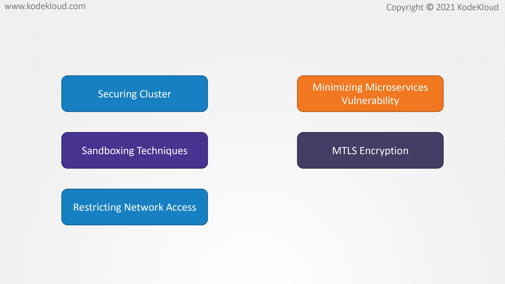
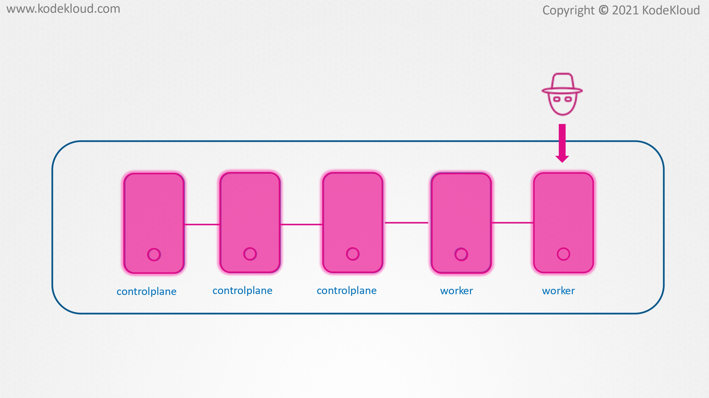
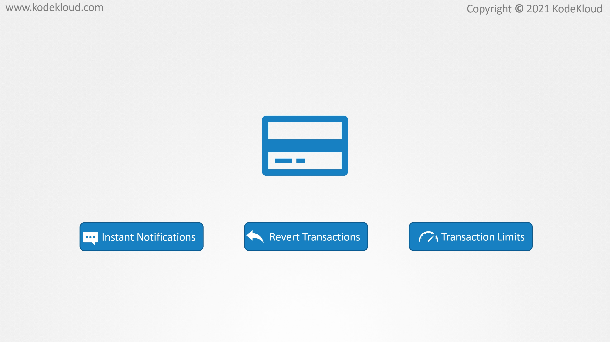
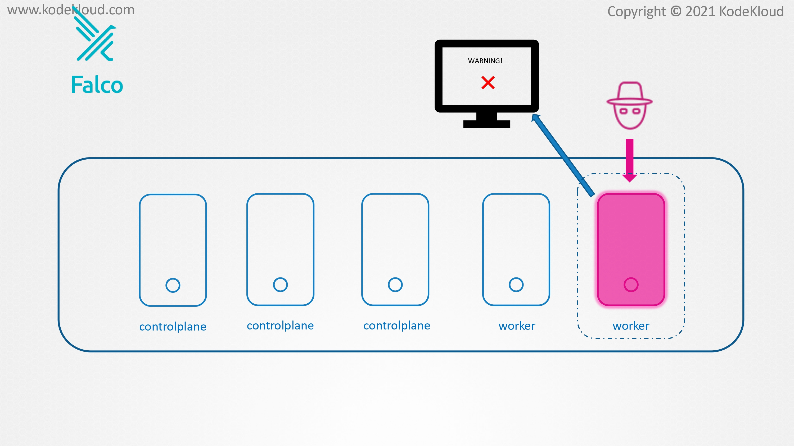
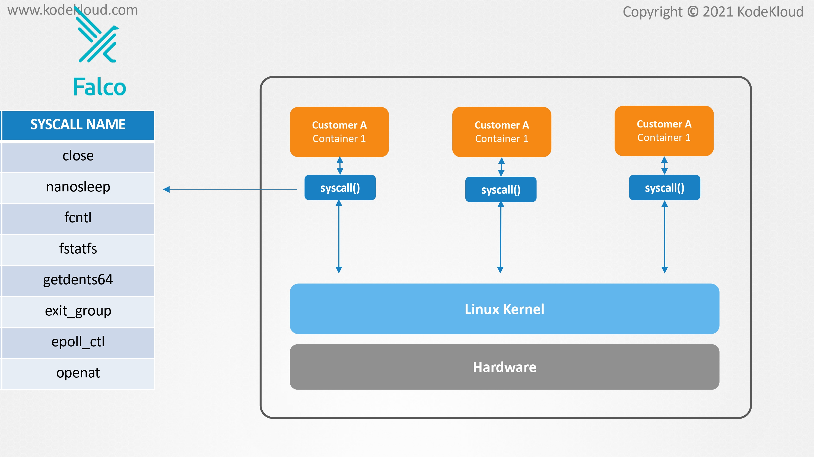
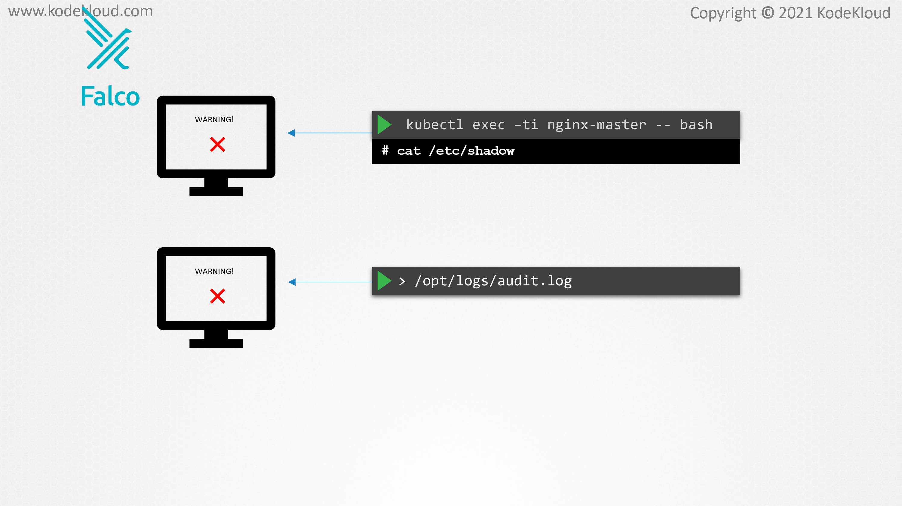

# Perform behavioral analytics of syscall process

<figure><figcaption></figcaption></figure>

* In this lecture, we will learn how to monitor our Kubernetes clusters against abnormal behavior, possible ongoing cyber attacks, and security breaches.&#x20;
* Throughout the course, we have seen different ways of securing our Kubernetes infrastructure, such as securing the control plane components, the workloads, limiting access to containers using sandboxing techniques, using mTLS, and restricting network access to nodes, et cetera.&#x20;
* Even if we use all of these techniques to secure our infrastructure, there is absolutely no guarantee that an attack will never happen in the future.&#x20;
* Theoretically there will always be a way for an attacker to get inside, so we still have to prepare for scenarios where something goes wrong and the containers become compromised.

<figure><figcaption></figcaption></figure>

* It might seem that if an attacker is already inside our systems, it is already too late and everything is lost. However, this may not necessarily be true every time. The sooner we find about something that went wrong, the better it is.

<figure><figcaption></figcaption></figure>

* To understand this, let us make an analogy of using credit or debit cards. Security has increased a lot in recent years.&#x20;
* Now, smart chips have been added to cards that make cloning much harder and make sure that authentication with the ATMs are much more reliable.&#x20;
* Even with all these added security measures, someone can still physically steal your card, and if they know your pin, they can withdraw money.&#x20;
* Now, they can also make use of contactless methods to withdraw money or make a purchase. In the past, without smartphones, if someone stole your money today, you may only find out about it days or weeks later when you check your bank balance.&#x20;
* By then, it could have been too late to reverse the transactions. Now, imagine that you get a notification on your smartphone every time your card is used.
* &#x20;As soon as someone steals from you, you get notified, and since you instantly find out about this, you can quickly call your bank and tell them about this problem.&#x20;
* They can track what happened and you can get your money back. Since transactions are still fresh, they can quite easily revert them.&#x20;
* Even if the attack happened, the damage can be minimized and it can be repaired if you react quickly.
* &#x20;To limit the damage further, you can set up daily transaction limits. In case of a compromised card, it can only be used for withdrawing limited amounts of funds, which can again be reversed if identified in time.&#x20;
* The same is applicable for computer systems that have been breached.

<figure><figcaption></figcaption></figure>

* If a breach does occur, it is crucial that we identify it as soon as possible. By reacting quickly, we can prevent the damage from spreading to other systems and reduce the blast radius. This would then allow us to replace the compromised nodes or pods and patch whatever security hole was used to get in, so that it can never be used again. How do we identify breaches that have already occurred in our Kubernetes cluster? For this, we can make use of tools such as Falco from Sysdig.

<figure><figcaption></figcaption></figure>

* &#x20;In the earliest sections of the course, we learned about syscalls in detail, and so how tools such as strace and Aqua Sec Tracee can be used to analyze the syscalls that are used by an application inside the pod. When we have hundreds of applications running on several hundred pods, which are generating thousands of syscalls, it is quite meaningless to just monitor the syscalls. What we need is a way to analyze the syscalls and filter events that are suspicious.

<figure><figcaption></figcaption></figure>

* For example, someone who's accessing the bash shell of a container or a program trying to access the /etc/shadow file where the password data are stored can be considered to be suspicious activities. Let's take a look at some more examples.&#x20;
* Attackers often want to erase tracks that they have ever been into the system, so they often try to delete some parts of logs that tracked how they got into the system in the first place. Normally, an administrator rarely has reasons to delete recent logs.&#x20;
* This activity can be considered anomalous and can be used as an early sign of intrusion. While it might have been an administrator who legitimately acts as the container shell and the programs which are accessing files under /etc are for non-malicious reasons, Falco can still monitor this event and then send alerts using various notification channels.&#x20;
* Well, that's it for this lecture. In the upcoming lecture, we will see how we can install Falco in our Kubernetes cluster and make use of it to detect and analyze threats.
