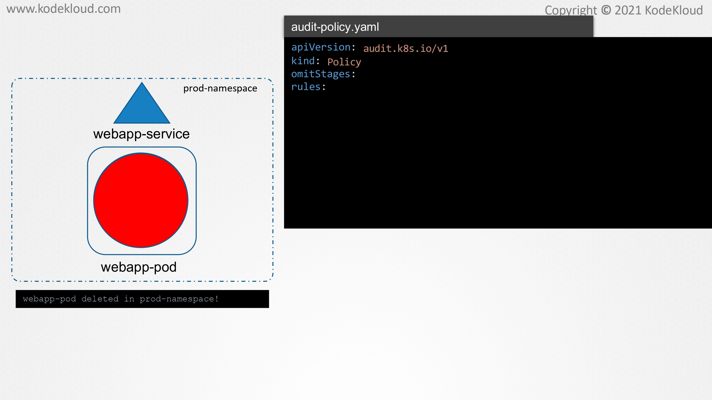
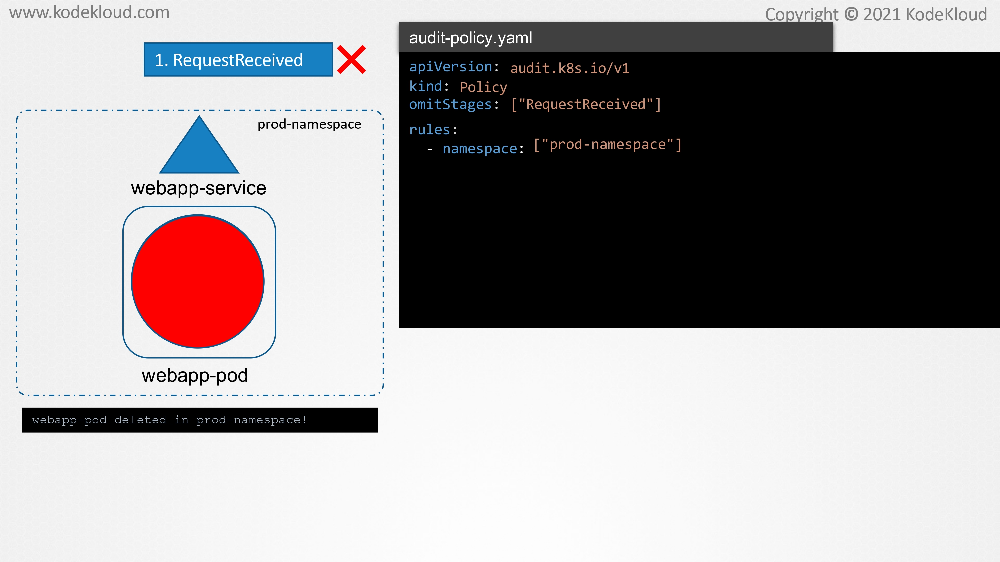

# Use Audit Logs to monitor access

<figure><figcaption></figcaption></figure>

* In this lecture, we will see how to audit events in Kubernetes. In the previous lecture, we saw how Falco detects suspicious events such as a shell being opened inside a container or writes happening to sensitive files or directories from within a container.&#x20;
* How do we audit and monitor what is happening within our Kubernetes cluster, such as which objects were created, who created it, when was it created, which namespace was it created inside, where was the request initiated from, et cetera.
* &#x20;All these bits of information are called as events in Kubernetes. Auditing events would allow us to detect suspicious or abnormal operations within the Kubernetes cluster and luckily, Kubernetes provides auditing by default and it is handled by the kube-apiserver.

<figure><figcaption></figcaption></figure>

* Before we look at how auditing is achieved, let us quickly look at the different stages that a request has to go through in Kubernetes.
* &#x20;All requests made to the Kubernetes cluster has to go through the kube-apiserver. When we send a request to the Kubernetes cluster, such as for creating a new nginx port, it is the kube-apiserver that receives this request.
* &#x20;As soon as a request is made to the kube-apiserver, it goes through what is known as the RequestReceived stage.&#x20;
* In this stage, events are generated, irrespective of whether the request is valid or not. Once the request is authenticated, validated, and authorized, another event called ResponseStarted is generated.
* Now, this is applicable for requests that can take some time to complete, such as when making use of the --watch flag with the kubectl get command to continuously observe the states of objects. Once a request has been completed, a response body is sent back.
* This stage is known as the ResponseComplete stage. Finally, in case of an invalid request or an error, the request goes through a Panic stage.
* &#x20;Each of these stages that we have seen here, RequestReceived, ResponeStarted, ResponseComplete, and Panic generate events that can be recorded by the kube-apiserver. However, it does not do this by default.
* &#x20;Before we do that, before we enable auditing, let us remember this. If we record all the events that are generated for every stage within our kubernetes cluster, we would end up with hundreds and thousands of logs within no time, which would be quite useless in what we want to achieve.

<figure><figcaption></figcaption></figure>

* Our goal is to make sure that only specific events are recorded, such as only logging deletions of pods in a specific namespace.&#x20;
* To do this, we can make use of a policy object, one that will contain all our rules for the kube-apiserver to use and record events that match the condition.
* &#x20;We do this by creating a policy object configuration file like this.&#x20;
* The apiVersion to use as of version 1.20 is audit.k8s.io/v1 and the kind is Policy and it contains two sections, omitStages and rules.

<figure><figcaption></figcaption></figure>

* The omitStages section is optional, but when it is defined, the events of this stage will not be recorded. For example, we may choose not to record events for the RequestReceived stage and for that, we pass in the name of the stage as an array.&#x20;
* All the conditions that we want this policy to match while recording events is placed under the rules section, such as the namespace the objects are in, the type of operations to be logged, the verbosity of the logged events, et cetera.&#x20;
* To demonstrate this, let us make use of the same example that we see on the left. We want to record events if pods inside the prod-namespace are deleted.&#x20;
* To specify the namespace within our policy, add a namespace like this and specify the prod-namespace as an array like this.&#x20;
* Namespace is an optional field and if it is unspecified, the policy will consider all objects across all namespaces wherever it is applicable.

<figure><figcaption></figcaption></figure>

<figure><figcaption></figcaption></figure>

<figure><figcaption></figcaption></figure>

<figure><figcaption></figcaption></figure>

<figure><figcaption></figcaption></figure>

<figure><figcaption></figcaption></figure>

<figure><figcaption></figcaption></figure>

<figure><figcaption></figcaption></figure>
