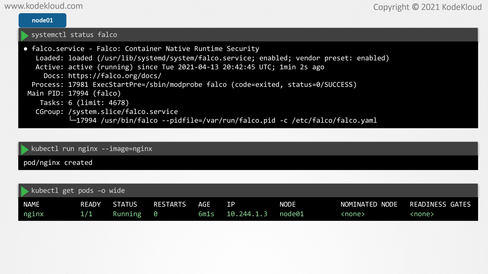
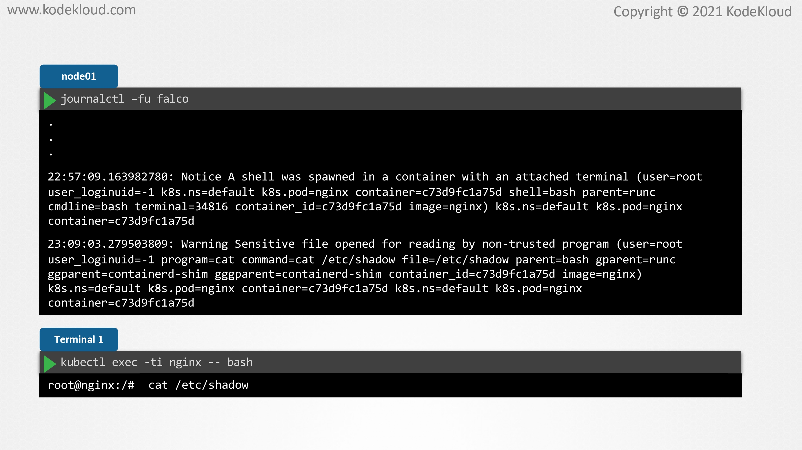
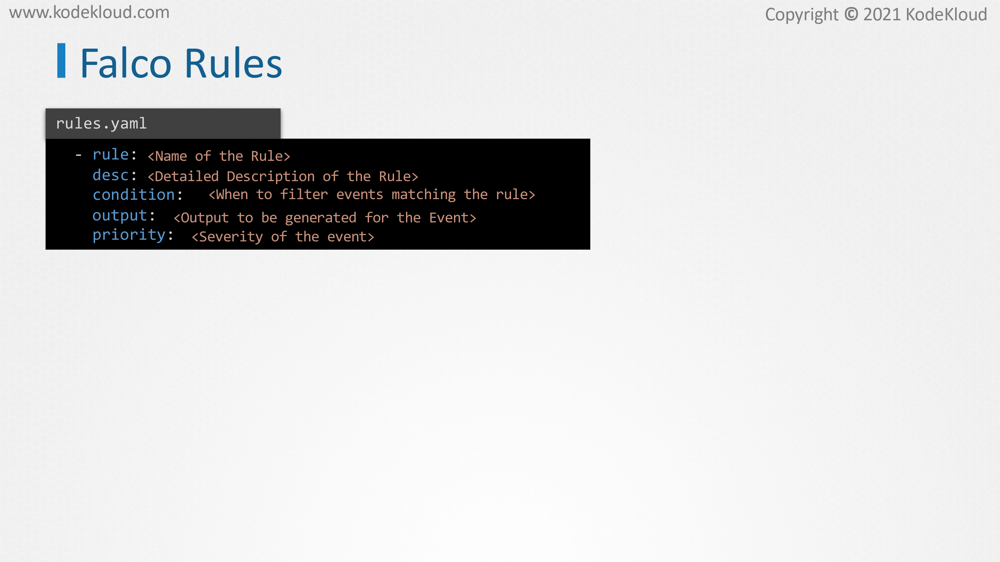
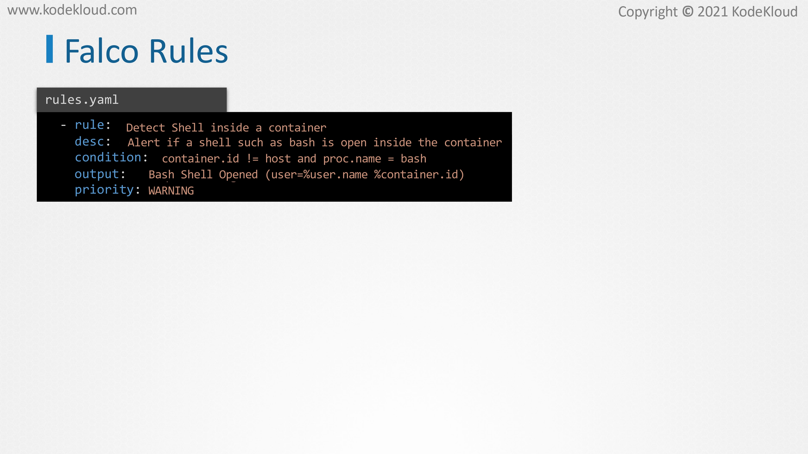
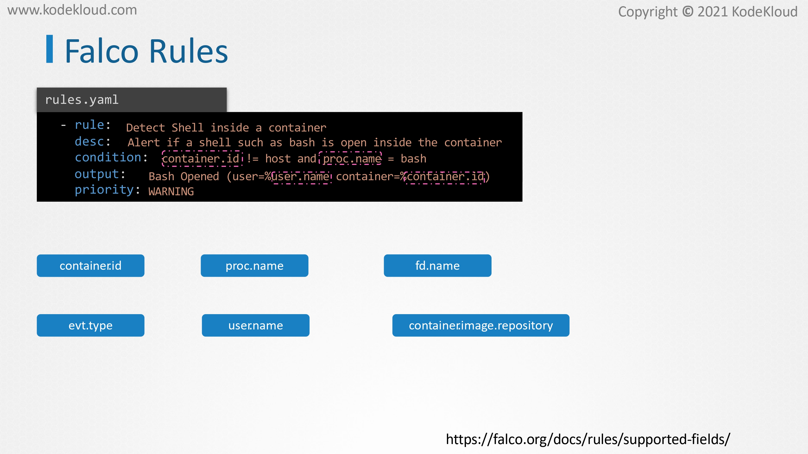
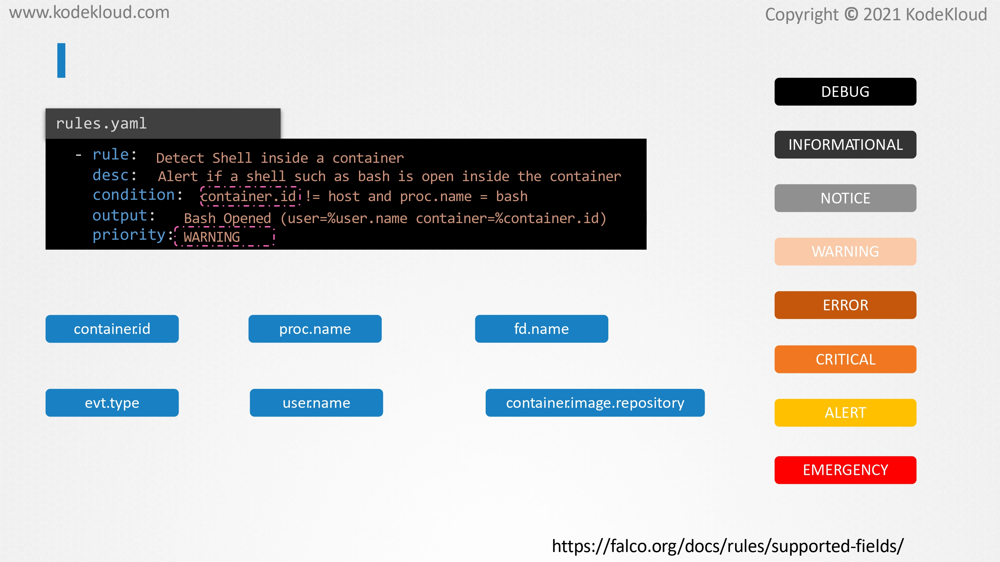
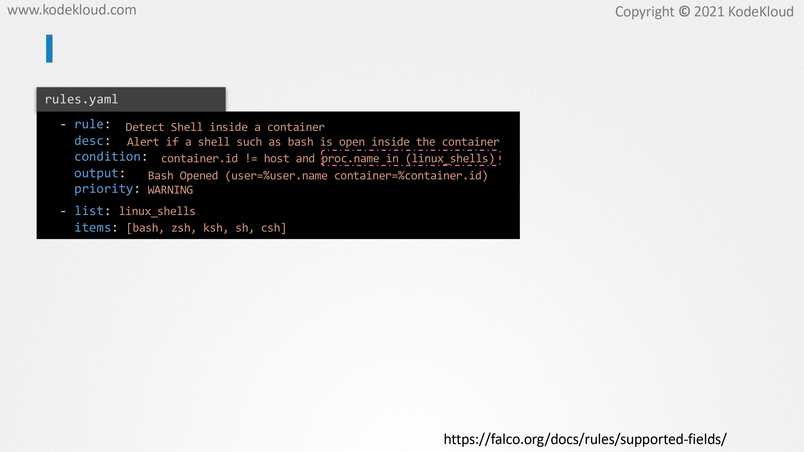
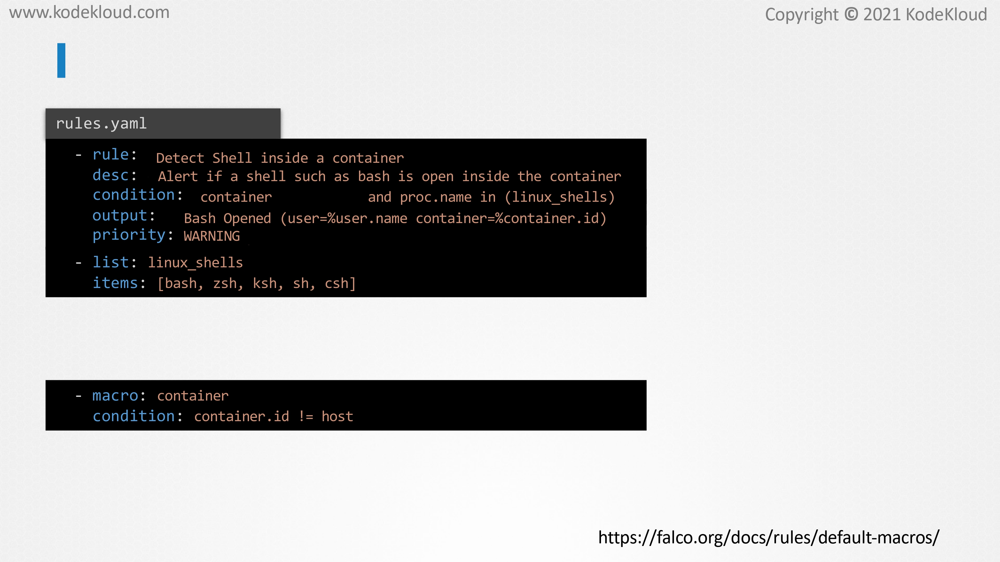

# Use Falco to Detect Threats

<figure><figcaption></figcaption></figure>

* Now that we have installed Falco in our cluster, let us use it to detect and alert suspicious behavior. Before we begin, let us make sure that Falco is running as expected on the nodes of the cluster.
* &#x20;Let us assume that Falco was actually installed as a package on the host, we can make use of the systemctl status Falco command to check if it is running on the host.&#x20;
* Next, let us create an engine export. In this case, we can see that it is running on the node 01.

<figure><figcaption></figcaption></figure>

* On a separate terminal, SSH to node 01 and run the command journalctl -fu falco. This will allow us to inspect the events that are generated by the Falco service.&#x20;
* The -u flag here will make sure that new events are continuously printed to the screen as soon as they are created.
* &#x20;You may notice a lot of existing logs here.&#x20;
* Let us ignore these for now. Next, back on terminal one, let's open a shell on the Nginx container by using the kubectl exec command. Immediately, an alert should be visible on the journal logs that says that a shell was spawned inside the container of the Nginx.
* &#x20;It will also provide us with other outputs such as the container ID, the image used for Nginx, the namespace et cetera.&#x20;
* Next, let us also read the contents of the/etc/shadow file inside the container on terminal one. Another warning is immediately displayed notifying that a sensitive file was opened inside a container.&#x20;
* Falco knew that someone had opened a shell inside the Nginx container and opened the shadow file. How did that happen?

<figure><figcaption></figcaption></figure>

* &#x20;In the previous lecture, we had a quick overview of how Falco works, to define which event should be considered as an anomaly and send us an alert we use Falco rules.
* &#x20;Falco implements several rules by default, one of which alerted us that a shell was open inside a container and another one that warned us that sensitive files were read inside this container.&#x20;
* These rules are defined within what is known as the rules file.

<figure><figcaption></figcaption></figure>

* A Falco rules file is a YAML file, just like the definition files for Kubernetes objects. This file contains three types of elements, rules, lists, and macros.&#x20;
* The first element that we are going to look at is rules as it is the fundamental element of rules file. The rules element defines all the conditions under which an alert should be triggered and it consists of five mandatory keys.&#x20;
* The first key is a rule which accepts a unique name for the rule. We then have the description key which is the long description of what the rule does. Next, we have the condition key which is a filtering expression that is applied against events to match the rule.
* &#x20;We will see this in more detail soon. Then we have the output key, which is the output message to be logged if an event matches the rule. Finally, we have the priority which is the severity that is set for that rule.

<figure><figcaption></figcaption></figure>

* Using this file as a template, let us now create our own custom rule from scratch. This rule will alert us in case a shell is opened in the container similar to the default rule that we just saw. Let us use detect shell inside a container as a rule name, and let us also add an appropriate description for this rule. For the condition, let's use a logical expression like this.&#x20;
* Here, we want an event to be filtered if the Bash process was run, but only when it is run inside a container. If it was opened within the host, the event should be ignored. Next, let us define a custom output message to be logged one which reads Bash shell opened and it should also include the user that opened the Bash shell as well as the container ID.&#x20;
* Finally, we can set the priority for this event. Let us set it to warning for this example. Let us now try to understand how this rule is configured.

<figure><figcaption></figcaption></figure>

* The first two fields which is rule and description is self-explanatory. Let's take a closer look at the condition, output, and priority. Let's look at conditions first.&#x20;
* Here we want the event to be matched only if the Bash process was run inside the container.&#x20;
* For that, we make use of a filter called container.id which should not be equal to host and another filter called proc.name which should be equal to Bash.&#x20;
* What is container.id and proc.name here? These are known as Sysdig filters and they are extensively used by Falco. The Falco policy engine makes use of these filters to extract information about an event such as the container ID, the process name, and several others.&#x20;
* The container.id filters the name of a container. The proc.name filters the name of the process. Similarly, some of the other commonly used filters are fd.name which is the name of the file descriptor.&#x20;
* This is used to match events against a specific file such as reading or writing inside a file. Then we have the event type filter which is used to filter system calls by name such as execve, open, accept, connect, et cetera.
* &#x20;The user.name filter is used to filter the user whose actions generated the event. The container.image.repository filters the specific images by name. Let's turn our attention to output now. We have again used filters here to log the name of the user that opened the shell into the container and the ID of this container.
* &#x20;We have only used a handful of filters here for our Falco rule. For more information on Sysdig filters, please use the link here.

<figure><figcaption></figcaption></figure>

* Finally, we can set severity to our rule by making use of the priority field. In this example, we have used the value as warning, but depending on the severity, we can change them to any of debug, informational, notice, warning, error, critical, alert, or emergency. Here, debug is the lowest severity and emergency is the highest severity that is available.&#x20;

<figure><figcaption></figcaption></figure>

* &#x20;We now have created a rule that will alert us when someone opens the Bash shell in a container, but what about other shells such as the Bourne shell, Zsh, Korn shell, et cetera? Instead of creating individual rules for each shell, we can make use of a list like this. Let's call the list Linux shells with an array of items that consists of all different possible shells that a container may use, such as Bash, Zsh, sh, or csh. Now we can update the condition to use this list like this.

<figure><figcaption></figcaption></figure>

* Now, let's try to simplify this rule even further. In this condition, we have used an expression with reads container.id should not be equal to host to make sure that the event happens inside the container and not on the host.&#x20;
* Now, instead of using this expression, we can make use of a shortcut like this. This shortcut is called a macro.&#x20;
* Here we have used a default macro called container which does the same thing as the expression that we used before.&#x20;
* By making use of this macro, the condition is now easy to write and understand. Similarly, there are several macros that can be used when writing custom rules.&#x20;
* For the complete list, check out the reference documentation in this link. Well, that's it for this lecture. In the next lecture, we'll get introduced to configuration files in Falco and learn how we can apply the custom rule that we just created.
