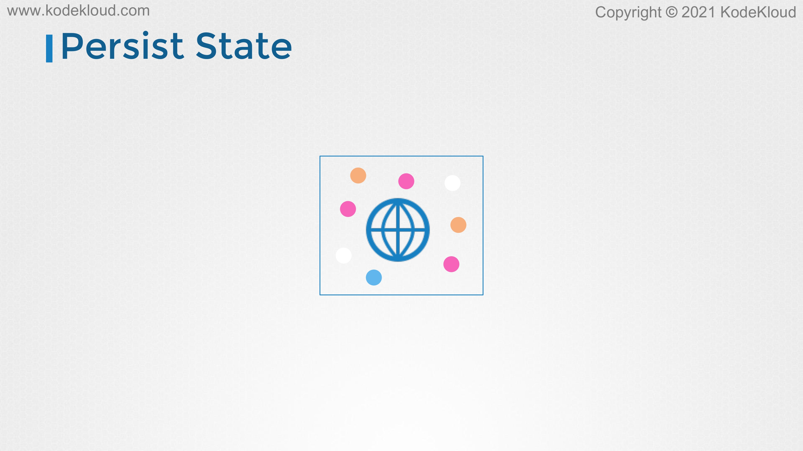

# Minimize base image footprint

<figure><figcaption></figcaption></figure>

* Hello, and welcome to this lecture. In this lecture, we look at minimizing the base image footprint. Let's start with the base images first.&#x20;
* These are some of the things that we discussed in the Docker certification course. We discuss a lot more about images and bills and best practices in the DCA course so check it out if you're interested.
* &#x20;Here I have my Docker file, which is used to build an image of my custom web application. The first line shows the image from which this image is built, which is httpd. It is the parent image on which my custom application is built.&#x20;
* Whatever image you use to build your custom image, that is called as the parent image.
* In this case, httpd is a parent image.

<figure><figcaption></figcaption></figure>

* How is the httpd image itself built? Let's take a look at the Docker file of the httpd image. The httpd image itself is built from another image, which happens to be the Debian image.&#x20;
* The httpd image starts with the Debian image, and then builds on to installing httpd on it. Let's go deeper and see what the Debian image itself is built on.

<figure><figcaption></figcaption></figure>

* We see that the Debian image is built from scratch. When an image is built from scratch, it is called as the base image.
* &#x20;Now, remember even though they're called as parent and base, so that's technically the difference between a parent image and a base image, you might find people using these terms interchangeably at times. It's not a big deal, parent image and base image can be referred to the same image.&#x20;
* Some people refer to the parent image as the base image. It's not a big deal. For the remainder of this lecture, we will refer to the base image as any image from which our image is built. It could be a parent image or a base image, but we will simply refer to it all just as base image.

<figure><figcaption></figcaption></figure>

* Let's look at some of the best practices that must be followed while building an image. To begin with, do not build images that combine multiple applications, such as a web server database, other services, all into one image.

<figure><figcaption></figcaption></figure>

* Instead, build images that are modular, that solve one specific problem, such as a separate image for a web server or a separate one for database. Each image can have its own libraries and dependencies and not really worry about the other application.
* These different images when deployed as containers can together form a single large application that has different services. Each component can scale up or down as required without having to scale the other components.

<figure><figcaption></figcaption></figure>

* Another best practice to be followed is not storing data or state inside a container. This is because containers are ephemeral in nature. We should be able to destroy them and bring them back online and not lose data along with the container. Always store data in either an external volume or some kind of caching service, like Redis.

<figure><figcaption></figcaption></figure>

<figure><figcaption></figcaption></figure>

* How do you choose a base image? Say you want to build your own web application and instead of building one from scratch, you want to start from an existing base image. Which one do you choose? Of course, you start by looking at images that suit your technical needs, such as, say your application requires httpd then you look for httpd images or if you're building an Nginx-based server, then you use the Nginx base image.
* &#x20;In this case, my application requires an httpd server so I look for httpd images on Docker Hub. Now, you must look for images with authenticity.

<figure><figcaption></figcaption></figure>

* &#x20;The official image or verified publisher tag indicates that the image is from official sources.

<figure><figcaption></figcaption></figure>

* Images must also be up to date. Images that are constantly updated are less likely to have vulnerabilities in them because they're more frequently updated and vulnerabilities are fixed.
* We will talk about vulnerabilities in images in one of the upcoming lectures.

<figure><figcaption></figcaption></figure>

* Now, when creating images, make sure to keep the size of the image as small as possible. This will allow images to be pulled faster from remote repositories and spin up more instances easily as required.
* There are minimal versions of official operating systems available, so try to use them as base images. Only install libraries packages that are absolutely necessary for the application to run and delete and clean up as much as possible.
* Do not add unnecessary files or temporary files to the image. Remove tools like curl or wget that could be used by attackers to download files if they were to gain access to the container.
* If you have package managers like YUM or APT, then those can be used to install unwanted software. Those must be removed as well.&#x20;
* Now at times, development environments may have debug tools or other packages that are required for development. These need not be part of production instances. It is a good idea to not include these in production images.
* You may consider having different images for different environments. All of these will ensure that the images you build are minimal in size, thereby making it faster to build and pull as well as secure as you're not adding any packages that may be used by attackers to install malicious software and exploit vulnerabilities.

<figure><figcaption></figcaption></figure>

* &#x20;Now, one such set of images are Google's Distroless Docker images, they contain only the application and its runtime dependencies, and does not contain package managers or shells or network tools, text editors, or other unwanted programs. Now, more information about this can be found in this link below.

<figure><figcaption></figcaption></figure>

* A minimal image is also less vulnerable to attack. For example, a quick scan of the vulnerability run on an httpd image using the Trivy tool shows that there are at least 124 known vulnerabilities in it, but when we run the same on an httpd:alpine base image, we see that there are zero vulnerabilities. The lesser packages there are within an image, the fewer the vulnerabilities will be. We will talk about vulnerability scanning and the Trivy tool in more detail in one of the upcoming lectures.
