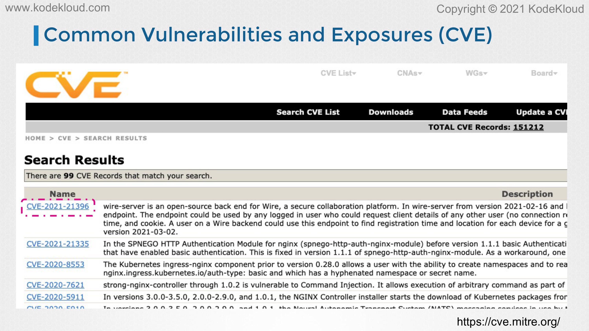
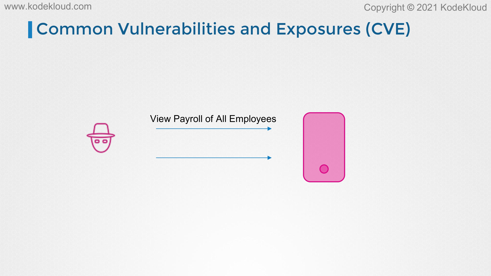
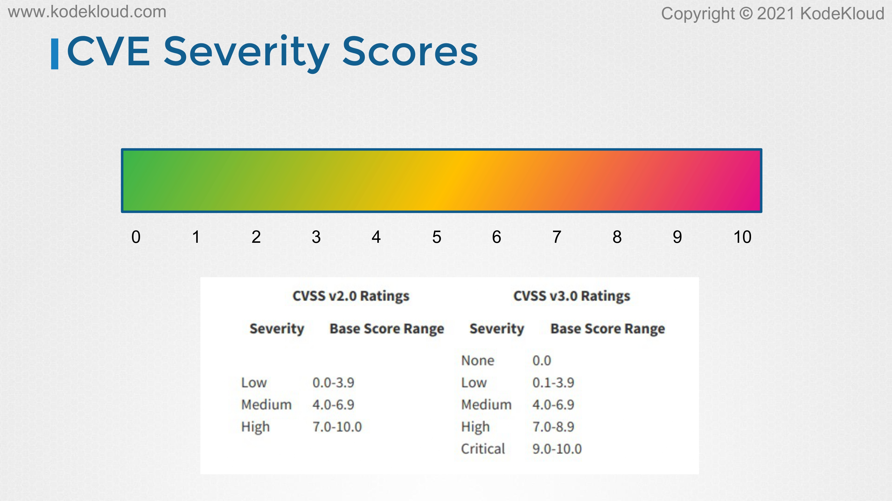
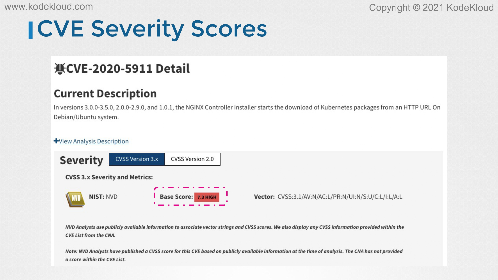
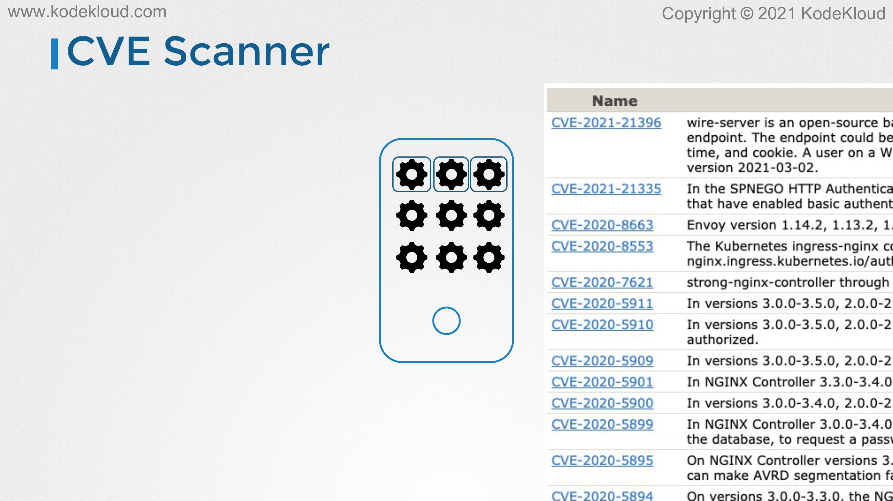
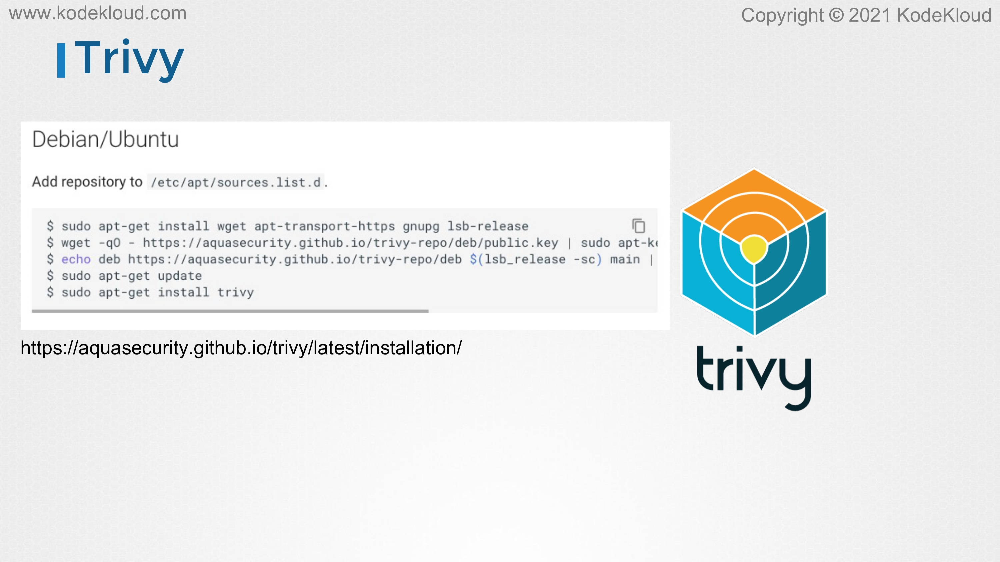
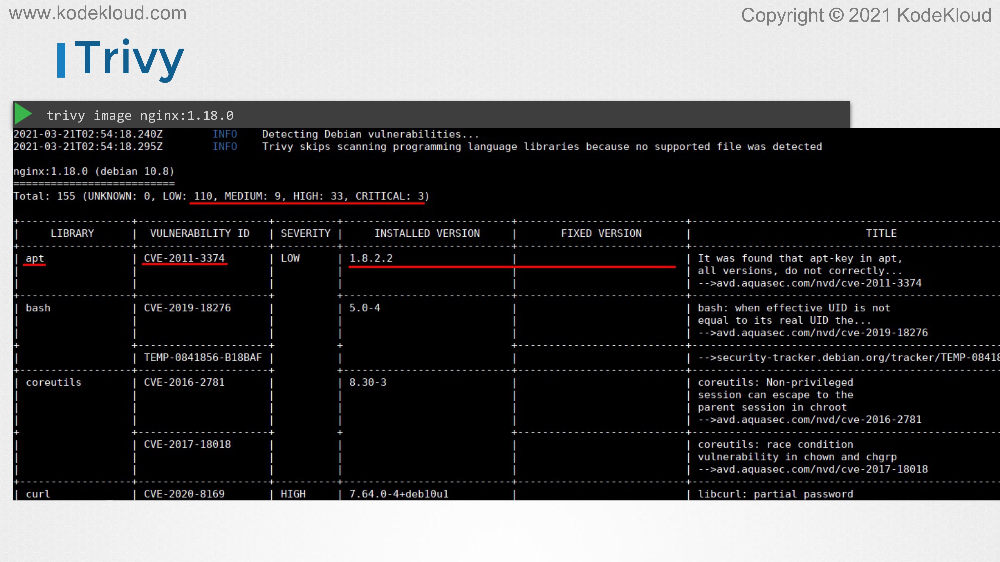
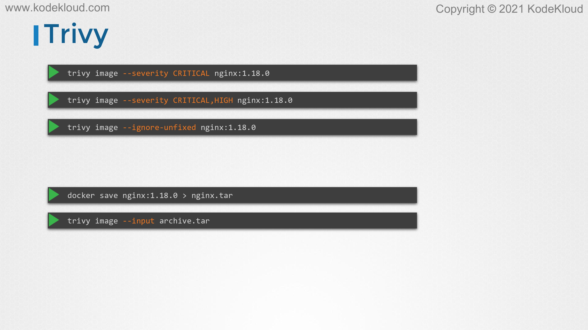
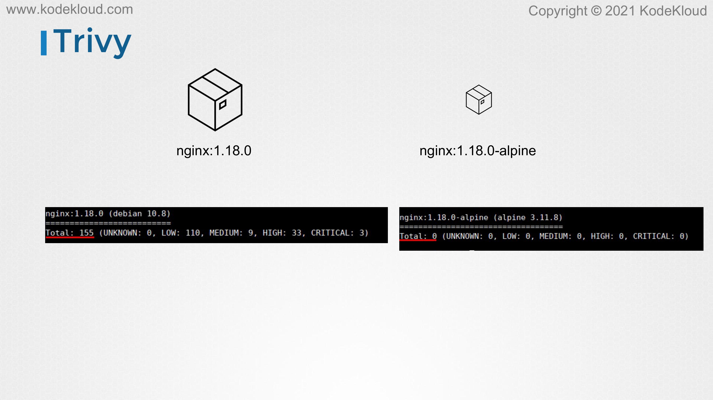
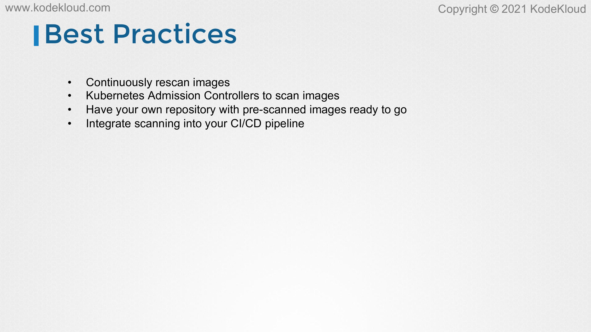

# Scan images for known vulnerabilities (Trivy)

<figure><figcaption></figcaption></figure>

* Hello, and welcome to this lecture. In this lesson, we'll learn how to scan container images to make sure they do not have any known security vulnerabilities that attackers can easily exploit.
* &#x20;To understand how this scanning software works, we'll first need to learn about CVEs. What is a CVE? CVE is short for common vulnerabilities and exposures. Computer code is not perfect. If a bad guy finds this bug, they use it to abuse the system. If the good guys finds these bugs, it would be nice if they can tell the whole world about it so we can all get informed, correct the code, update our software and make our systems a little bit safer. We need a central database so that anyone can submit this information when he or she finds it. This makes it easier to report bugs and avoid duplicate entries. Each CVE gets a unique identifier. It also makes it easier to find information or look up known bugs for a particular application and so on.

<figure><figcaption></figcaption></figure>

* &#x20;What kind of problems or bugs are considered as CVEs and can enter a CVE database? It's usually one of the two things. Anything that allows an attacker to bypass security checks and do things that he or she shouldn't be allowed to do. Say, for example, view the payroll details of all employees, something that only authorized users should have access to. The other kind of problem is anything that allows an attacker to mess up your system or seriously degrade performance, interrupt services, and so on. Now there are other issues too, but usually, it falls into these major categories.

<figure><figcaption></figcaption></figure>

* Each CVE gets a severity score or severity rating between zero to 10 or none, low, medium, high, and critical. Now we'll often have to deal with a very high number of vulnerabilities and these scores can help us get an idea at a glance of what we should worry more or less about. They can help us prioritize what to take care of first. If we see a score of 9.5 or critical, it's a good indicator that's a serious problem that we should deal with immediately and leave the ones with lower scores for later. A very high score can also be interpreted along the lines of the attacker can do a lot more damage or the attacker can assume total control of your system. Lower scores might mean that they can do some things that they shouldn't be able to do, but nothing terribly bad.

<figure><figcaption></figcaption></figure>

* Here's an example of a CVE identified where the NGINX controller installer starts the download of Kubernetes packages from an HTTP URL instead of HTTPS on Debian and Ubuntu systems. The severity score for this is 7.3 which is pretty high.

<figure><figcaption></figcaption></figure>

* Our servers have numerous packages and services running on them with containers and container orchestration involved. There are additional processes running in the form of containers. Now, while we discussed that we should keep these at a minimum and remove all unnecessary packages and software, how do we know how vulnerable the packages on our system are and how vulnerable the containers are? That's where CVE scanners can help us. Container scanners look for vulnerabilities in the execution environment. More specifically such a scanner, it looks at applications included in that container and tells you what vulnerabilities they are known to have. For example, it sees that you have the NGINX version 1.14.2 in there. Based on this version, it can then tell you a list of known vulnerabilities for that particular version. Now once the list of vulnerabilities are identified you may choose to upgrade to a newer version that fixes these problems or implement additional security measures that prevent the problems from being exploited or remove that package if it is not needed necessarily. As discussed before, the more packages you have on your system, it's more likely to have larger number of vulnerabilities. A solution is to reduce attack surface by removing unnecessary packages. Now let's look at one such vulnerability scanner in more detail.

<figure><figcaption></figcaption></figure>

* Trivy by Aqua Security is a simple and comprehensive vulnerability scanner for containers and other artifacts and is suitable for integration with CICB pipelines. The installation instructions can be found in their documentation pages, and it's as easy as installing the dependencies and installing the Trivy packets. You'll do this yourself in the upcoming labs.

<figure><figcaption></figcaption></figure>

* Once installed, initiating a scan is as easy as running the Trivy image command followed by the name of the image. You specify the name of the image, as you would specify it in a Docker run command. It then runs a vulnerability scan and returns a summary of all vulnerabilities detected in that image. In this example, it's identified 110 low-risk vulnerabilities, 9 medium risk, 33 high, and 3 critical risk vulnerabilities. It then lists details about each of this vulnerability, its ID, the severity, and the description about the issue.

<figure><figcaption></figcaption></figure>

* The Trivy command can take additional options to filter results such as the severity flag takes a severity and only lists vulnerabilities of that severity level. In this example, we are displaying only critical and high severity vulnerabilities. If you're only interested in the CVEs that we can immediately fix by upgrading vulnerable software packages, we can use the ignore unfixed command-line option like this. Say you save a Docker image into a tar archive format like this with the Docker save command, we can use Trivy to scan the image in the archive format using the input option like this, and by specifying the name of the tar archive.

<figure><figcaption></figcaption></figure>

* Earlier we discussed that one of the solutions to reduce vulnerabilities is by reducing the attack surface by using images with minimal packages in them. Here now there are two images, the NGINX 1.18.0 full-blown image and the NGINX 1.18.0-alpine image. The output from a Trivy scan reveals that the first image has 155 total vulnerabilities and the second one has zero. This indicates that the lesser the number of packages there are the more reduced the attack surface is. You must always choose an image that is stripped down of all unnecessary packages

<figure><figcaption></figcaption></figure>

* .Let's talk about some of the best practices. We just saw that we scanned the NGINX container and it reported zero CVEs. However, a few months later, some new security issues might be discovered. That's why you want to periodically rescan your images and make sure that they're still safe to use. We integrate scanning into deployment using admission controllers in Kubernetes. We discussed about admission controllers before. Admission controllers can be used to initiate scan of images every time before a pod gets deployed. As you can imagine that might delay the deployment process and so an alternate approach is to have an internal registry with pre-scanned images that are ready to go. This way you don't have to scan the image each time it is deployed. Finally integrate scanning into your CI/CD pipeline for your custom applications. This way, every time code is pushed and a new image of the application is built, a scan of the image is automatically performed, and vulnerabilities are reported at the source.
