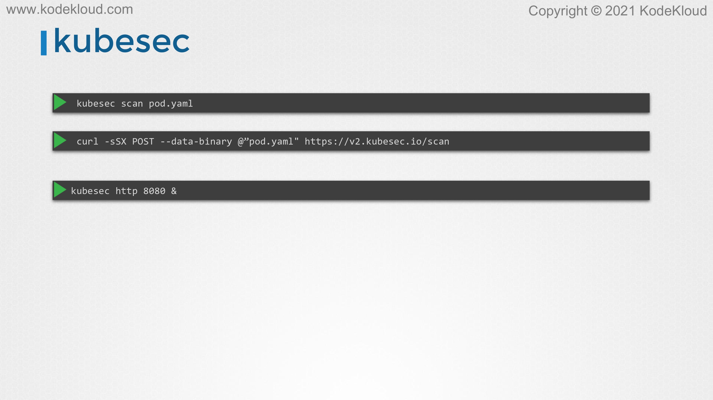

# Use static analysis of user workloads (e.g.Kubernetes resources, Docker files)

<figure><figcaption></figcaption></figure>

* In this lecture, we look at analyzing Kubernetes resource definition files and some tools that can help us with that. If you've learned that when you submit a request to create a pod, it goes through various stages. Again, depending upon the type of admission controller, we have configured it either gets created or rejected. However, all of this happens after the user develops the definition files and executes the kubectl commands to create the request. What if we want to catch the security-related issues or enforce standards even before it is deployed to the cluster, even before the user runs the kubectl command, right after the files are developed?

<figure><figcaption></figcaption></figure>

* That's static analysis of definition files. That's what we are going to look at in this lecture. With static analysis, we review the resource files and enforce policies earlier in the development cycle before it is actually pushed to the cluster.

<figure><figcaption></figcaption></figure>

* &#x20;One such tool that can help with analysis is kubesec from the control plane. It's available at kubesec.io. Kubesec helps analyze a given resource definition file and returns its score along with details about the critical issues that were found in it.

<figure><figcaption></figcaption></figure>

* In this case, it's rightly detected the issue with a privileged container and it has assigned a score of -30 to this particular pod definition file. It also gives a reason why this particular issue is critical. How do we get started with the kubesec?
*

    <figure><figcaption></figcaption></figure>
* Kubesec can be installed as a binary locally and run as kubesec. In this case, you could run a command kubesec scan and then specify the name of the resource file, which is pod.yaml, or you could post a request to kubesec's publicly hosted service using curl like this, a v2.kubesec.io is a publicly hosted version of kubesec.&#x20;
* If you use curl command and post a request by specifying the pod.yaml as a data binary, then it'll perform the analysis and return the results, or you could run kubesec as a server locally by running the kubesec http command with a port 8080.&#x20;
* That will run at kubesec instance locally on your server.
