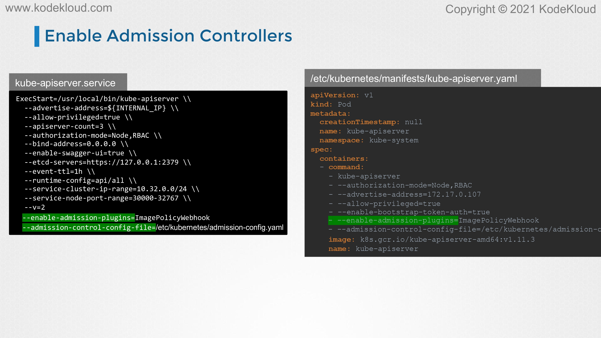

# Whitelist Allowed Registries - Image Policy Webhook

<figure><figcaption></figcaption></figure>

* Hello, and welcome to this lecture. In this lecture, we will look at whitelisting allowed registries. As a user with access to the Kubernetes cluster, I could deploy any application in the form of a pod in the cluster. Here's a simple pod definition file. In the image field, I could use any image I want. For example, an image from some-registry.io/a-very-vulnerable- image.
* With no one to stop me from doing that, that vulnerable image could risk the security of all other applications running on the cluster.
* If hackers gain access to that image, they may exploit vulnerabilities in the image and access other applications running on the cluster or even crackdown into the underlying operating system.
* It's important to have governance in placed to ensure images are pulled from approved registries only.

<figure><figcaption></figcaption></figure>

* How do we prevent users from using images from unwanted registries? How do we add that kind of a restriction? Now, we have discussed this before. We talked about admission controllers earlier in the course. When a request comes in, they are to create a pod. It goes through authentication, authorization, and then through admission controllers before being created.
* We talked about the mutating and validating admission controllers. We said that we could deploy our own admission webhook server and configure the validating admission webhook to make a call to the server and say within the admission webhook server, we check if the image name has, say, internal-registry.io in it or something.
* Then if that is not the case, we reject the request with an error message that says that is not from a supported registry. We can perform any kind of checks and add any kind of error messages there. That's one way of using admission controllers to restrict registries.

<figure><figcaption></figcaption></figure>

* Another option that we learned is to deploy an OPA service then configure validating webhook to connect to the service and then we create policies to restrict trusted registries using the Rego tool.
* We have seen how to deploy and configure OPA in the previous lectures and labs.

<figure><figcaption></figcaption></figure>

* A third option is to configure a built-in admission controller known as image policy webhook. Let's see how that works now. For this, again, we deploy an admission webhook server and then we enable and configure the image policy webhook to communicate with the admission webhook server using an admission configuration file.
* We will see how to do that next.

<figure><figcaption></figcaption></figure>

* The admission configuration file will contain configuration details for the image policy webhook. This will have a kubeconfig formatted file will the access details of the admission webhook server and below we have the default allow property which is set to true.
* This means that if the admission webhook server does not exist or is not contactable or does not explicitly deny a request, the default behavior would be to allow the pod to be created.
* Setting this to false will mean by default all requests will be rejected unless explicitly allowed by the webhook server.
* In this case, it's set to true, that would mean if for some reason the admission webhook server was not contactable or it does not specifically deny a request, then all the requests will be allowed.

<figure><figcaption></figcaption></figure>

* The access details of the admission webhook server is configured through a kubeconfig formatted file as we just said. That's how the file looks. Remember the kubeconfig file that we talked about earlier in the CKA course and the file that we have been using that can be configured to gain access to different clusters with different credentials, the same kind of file is used here to configure access to the image policy admission webhook server.
* Under the clusters, we configure the URL to the policy server, and under users, we configure the certificates to be used to connect to that server.

<figure><figcaption></figcaption></figure>

* Once this is set up it is now time to enable the image policy webhook admission controller. To enable the admission controller added to the enable plugin's flag on the API server, this we have seen numerous times before.
* What you see on the left is for the kube API server configured as a service, the one you see on the right is the kube API server configured as a studied pod in the kubeadm based setup. Another flag that you have to pass in is the admission control config file that we created.&#x20;
* This is done using the admission control config file's flag. That should be it. With this configuration, the image policy webhook will be enabled and the admission config file will be configured.

<figure><figcaption></figcaption></figure>
