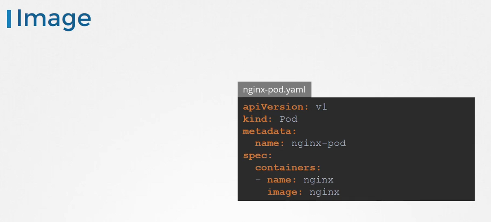

# Restrict Kernel Modules

<figure><figcaption></figcaption></figure>

* In this lecture, let us see how to restrict usage of certain kernel modules in Linux. The Linux kernel module has a modular design.
* &#x20;This allows the kernel to extend its capabilities by the means of dynamically loaded kernel modules. In simple terms this means that a new hardware device, when connected to the Linux computer can then be made available to the users by loading the corresponding kernel module.
* A common use case of this example is adding hardware support for a third party device, such as a video card, by making use of a device driver, which is provided by the kernel module.&#x20;
* Modules can also be loaded manually into the kernel by making use of the mod probe or the insmod command.

<figure><figcaption></figcaption></figure>

* For example, here we are loading the module called PC speaker using the mod probe command, which should be run as the root user. To list all the modules loaded into the kernel, use the lsmod command like this.
* However, please know that when we have Kubernetes workloads running on the source, even a unprivileged process running on a pod can cause certain network protocol related modules to be loaded into the kernel by creating a network socket. This can allow an attacker to exploit a potential vulnerability.

<figure><figcaption></figcaption></figure>

* To mitigate this issue, it is a good idea to blacklist the modules on all the nodes of the cluster. Blacklisting in the context of kernel modules as a mechanism to prevent the kernel module from loading.
* &#x20;For example, the SCTP kernel module is not commonly used within Kubernetes cluster, and we can blacklist it on the notes by adding the following entry to the blacklists configuration file like this.
* The name of the file in this example is blacklist.conf. However, you can use any name for this file as long as it is created under the slash /etc/modprobe.d directory, and has a file extension of .conf.
* Once this entry is added reboot the notes and test, if this module is listed in the lsmod command.

&#x20;

<figure><figcaption></figcaption></figure>

* Another module that should not be enabled on Kubernetes clusters is the DCCP module, which stands for datagram congestion control protocol. To blacklist this kernel module, do the same steps as before. Add the blacklist to the configuration file, reboot the system, and make sure that it is absent when we run the lsmod command again.
* For more information, refer to the section 3.4 in the CIS benchmarks for distribution independent Linux.

<figure><figcaption></figcaption></figure>
